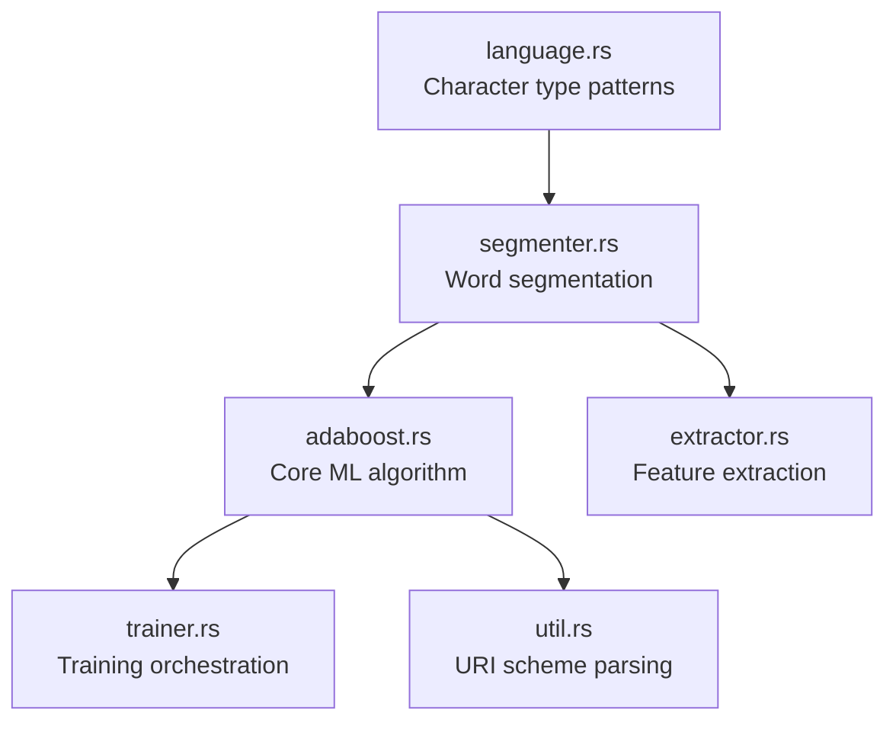

# モジュール設計

`litsea` ライブラリクレートは、それぞれ明確な責務を持つ 6 つのモジュールで構成されています。

## モジュール依存関係グラフ



## モジュールの詳細

### `language.rs` -- 言語定義

`Language` 列挙型と文字種分類システムを定義します。

- **`Language`** -- `Japanese`、`Chinese`、`Korean` のバリアントを持つ列挙型
  - `FromStr` を実装（`"japanese"`、`"ja"`、`"chinese"`、`"zh"`、`"korean"`、`"ko"` を解析）
  - `Display` を実装（小文字の名前を出力）
  - ファクトリメソッド `char_type_patterns()` が言語固有のパターンを返す
- **`CharTypePatterns`** -- 文字を種別コードにマッピング（例: ひらがなは `"I"`、カタカナは `"K"`）
- **`CharMatcher`** -- 正規表現ベースとクロージャベースの文字マッチングをサポートする内部列挙型

### `segmenter.rs` -- 単語分割

テキスト分割のための主要なユーザー向けモジュールです。

- **`Segmenter`** -- `Language`、`CharTypePatterns`、`AdaBoost` インスタンスを保持
  - `new(language, learner)` -- オプションの学習済みモデルでセグメンタを作成
  - `segment(sentence)` -- テキストを単語に分割し、`Vec<String>` を返す
  - `get_type(ch)` -- 単一文字をその種別コードに分類
  - `get_attributes(i, tags, chars, types)` -- 文字位置の特徴量セットを抽出
  - `add_corpus(corpus)` -- スペース区切りのコーパスから学習データを追加
  - `add_corpus_with_writer(corpus, callback)` -- カスタムコールバックでコーパスを処理

### `adaboost.rs` -- AdaBoost アルゴリズム

二値分類のためのコア機械学習エンジンです。

- **`AdaBoost`** -- 二値分類器
  - `new(threshold, num_iterations)` -- 学習パラメータを指定して作成
  - `initialize_features(path)` -- 学習ファイルから特徴量名を読み込み
  - `initialize_instances(path)` -- 学習ファイルからラベル付きインスタンスを読み込み
  - `train(running)` -- AdaBoost の学習ループを実行
  - `predict(attributes)` -- 境界（+1）または非境界（-1）を予測
  - `load_model(uri)` -- ファイルまたは URL からモデルの重みを読み込み（非同期）
  - `save_model(path)` -- モデルの重みをファイルに保存
  - `get_metrics()` -- 精度、適合率、再現率を算出
  - `get_bias()` -- モデルのバイアス項を取得
- **`Metrics`** -- 評価指標（精度、適合率、再現率、混同行列）

### `extractor.rs` -- 特徴量抽出

モデル学習のためにコーパスから特徴量を抽出します。

- **`Extractor`** -- `Segmenter` をラップしてコーパスファイルを処理
  - `new(language)` -- 特定の言語用の抽出器を作成
  - `extract(corpus_path, features_path)` -- コーパスを読み込み、特徴量ファイルを書き出し

### `trainer.rs` -- 学習オーケストレーション

すべてを結合する高レベルの学習ワークフローです。

- **`Trainer`** -- 学習パイプライン全体を統括
  - `new(threshold, num_iterations, features_path)` -- 特徴量ファイルから初期化
  - `load_model(uri)` -- 再学習のために既存のモデルをオプションで読み込み（非同期）
  - `train(running, model_path)` -- 学習を実行しモデルを保存、`Metrics` を返す

### `util.rs` -- ユーティリティ

モデル読み込みのための URI スキーム解析です。

- **`ModelScheme`** -- `Http`、`Https`、`File` のバリアントを持つ列挙型
  - URI プレフィックスに基づいてモデルの読み込み方法を決定するために使用

## パブリックエクスポート

ライブラリの `lib.rs` はすべてのモジュールを再エクスポートし、以下を提供します:

```rust
pub mod adaboost;
pub mod extractor;
pub mod language;
pub mod segmenter;
pub mod trainer;
pub mod util;

pub const VERSION: &str = env!("CARGO_PKG_VERSION");
pub fn version() -> &'static str { VERSION }
```
