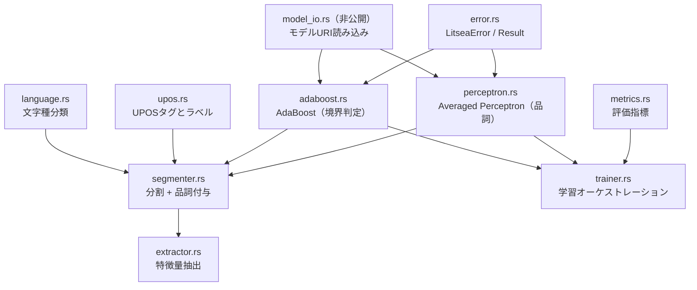

# モジュール設計

`litsea` ライブラリクレートは、それぞれ明確な責務を持つモジュールで構成されています。

## モジュール依存関係グラフ


```mermaid
graph TD
    language["language.rs<br/>文字種分類"]
    segmenter["segmenter.rs<br/>分割 + 品詞付与"]
    adaboost["adaboost.rs<br/>AdaBoost（境界判定）"]
    perceptron["perceptron.rs<br/>Averaged Perceptron（品詞）"]
    upos["upos.rs<br/>UPOSタグとラベル"]
    extractor["extractor.rs<br/>特徴量抽出"]
    trainer["trainer.rs<br/>学習オーケストレーション"]
    model_io["model_io.rs（非公開）<br/>モデルURI読み込み"]
    error["error.rs<br/>LitseaError / Result"]
    metrics["metrics.rs<br/>評価指標"]

    language --> segmenter
    upos --> segmenter
    adaboost --> segmenter
    perceptron --> segmenter
    segmenter --> extractor
    adaboost --> trainer
    perceptron --> trainer
    model_io --> adaboost
    model_io --> perceptron
    error --> adaboost
    error --> perceptron
    metrics --> trainer
```

## モジュール詳細

### `language.rs` -- 言語定義

`Language` enum と文字種分類を定義します。

- **`Language`** -- `Japanese`・`Chinese`・`Korean` のバリアントを持つ enum
  - `FromStr` を実装（`"japanese"`・`"ja"`・`"chinese"`・`"zh"`・`"korean"`・`"ko"` をパース）
  - `Display` を実装（小文字名を出力）
  - `char_type(c: char) -> &'static str` -- 文字範囲に対する `match` で文字を直接分類（アロケーションなし・正規表現不使用）。言語別関数（`japanese_char_type` など）が、共通の `"P"`/`"A"`/`"N"` クラス用の `punct_latin_digit()` ヘルパーを共有します。

### `segmenter.rs` -- 単語分割と品詞付与

主要なユーザー向けモジュールです。

- **`Segmenter`** -- `Language`、`AdaBoost` 学習器、オプションの `AveragedPerceptron` 品詞学習器を保持（フィールドは非公開。`language()`・`learner()`・`learner_mut()`・`pos_learner()`・`pos_learner_mut()` を使用）
  - `new(language, learner)` -- 学習済みモデル（任意）付きでセグメンターを作成
  - `with_pos_learner(language, pos_learner)` -- 分割+品詞付与用のセグメンターを作成
  - `segment(sentence)` -- テキストを単語に分割し `Vec<String>` を返す
  - `segment_with_pos(sentence)` -- 分割と品詞付与を行い `Vec<(String, Upos)>` を返す
  - `char_type(ch)` -- 1文字を種別コードに分類
  - `add_corpus(corpus)` / `add_corpus_with_pos(corpus)` -- 学習データを追加
  - `add_corpus_with_writer(corpus, callback)` / `add_corpus_with_pos_writer(corpus, callback)` -- カスタムコールバックでコーパスを処理

### `adaboost.rs` -- AdaBoost アルゴリズム

単語境界の判定に使う二値分類器です。

- **`AdaBoost`**
  - `new(threshold, num_iterations)` -- 学習パラメータを指定して作成
  - `initialize_features(path)` / `initialize_instances(path)` -- 学習データを読み込み
  - `train(running)` -- AdaBoost の学習ループを実行
  - `predict(&attributes)` -- 境界（+1）か非境界（-1）かを予測
  - `load_model(uri)`（async）/ `load_model_from_path(path)` / `load_model_from_reader(reader)` -- モデルの読み込み
  - `save_model(path)` -- モデルをファイルに保存
  - `metrics()` -- 正解率・適合率・再現率を計算（`BinaryMetrics`）
  - `bias()` -- モデルのバイアス項を取得

### `perceptron.rs` -- Averaged Perceptron

分割+品詞付与に使う多クラス分類器です。

- **`AveragedPerceptron`**
  - `add_instance(features, label)` -- 学習インスタンスを追加
  - `train(num_epochs, running)` -- 重み平均化付きで学習
  - `predict(&features)` -- 最良クラスのラベルを予測
  - `load_model(uri)`（async）/ `load_model_from_path(path)` / `load_model_from_reader(reader)` -- モデルの読み込み
  - `save_model(path)` -- モデルを保存
  - `metrics()` -- マクロ平均の評価指標（`MulticlassMetrics`）
- 重みは高速な推論のため「特徴 → クラス別ベクトル」レイアウトで保持します。

### `upos.rs` -- Universal POS タグ

- **`Upos`** -- Universal Dependencies の17品詞タグ（`NOUN`、`VERB`、...）
- **`SegmentLabel`** -- 文字位置ごとの分割+品詞の複合ラベル（`B(Upos)` または `O`）。`"B-NOUN"` / `"O"` 文字列形式の `Display`/`FromStr` を実装

### `extractor.rs` -- 特徴量抽出

モデル学習用にコーパスから特徴量を抽出します。

- **`Extractor`** -- `Segmenter` をラップしてコーパスファイルを処理
  - `new(language)` -- 言語を指定して作成
  - `extract(corpus_path, features_path)` -- コーパスを読み、特徴量ファイルを書き出す
  - `extract_with_pos(corpus_path, features_path)` -- 品詞付きコーパス版

### `trainer.rs` -- 学習オーケストレーション

高レベルの学習ワークフローです。

- **`Trainer`** -- 分割モデルの学習（AdaBoost）
  - `new(threshold, num_iterations, features_path)` -- 特徴量ファイルから初期化
  - `load_model(uri)` -- 増分学習用に既存モデルを読み込み（async・任意）
  - `train(running, model_path)` -- 学習・保存して `BinaryMetrics` を返す
- **`PosTrainer`** -- 品詞モデルの学習（Averaged Perceptron）
  - `new(num_epochs, features_path)` / `load_model(uri)` / `train(running, model_path)`（`MulticlassMetrics` を返す）

### `error.rs` -- エラー処理

- **`LitseaError`** -- エラー enum（`Io`・`InvalidData`・`InvalidInput`・`Unsupported`、`remote_model` フィーチャー時は `Download` も）
- **`Result<T>`** -- すべての失敗しうるAPIが使うエイリアス

### `metrics.rs` -- 評価指標

- **`BinaryMetrics`** -- 正解率・適合率・再現率・混同行列（AdaBoost）
- **`MulticlassMetrics`** -- 正解率とマクロ平均適合率/再現率（Averaged Perceptron）

### `model_io.rs` -- モデル読み込みI/O（非公開）

モデルURI（プレーンパス、`file://`、`remote_model` フィーチャー時の `http(s)://`）を解決して生のモデルバイト列を返す内部モジュールです。公開APIには含まれません。

## 公開エクスポート

ライブラリの `lib.rs` は公開モジュールと主要型の再エクスポートを提供します:

```rust
pub mod adaboost;
pub mod error;
pub mod extractor;
pub mod language;
pub mod metrics;
mod model_io;
pub mod perceptron;
pub mod segmenter;
pub mod trainer;
pub mod upos;

pub use adaboost::AdaBoost;
pub use error::{LitseaError, Result};
pub use extractor::Extractor;
pub use language::Language;
pub use metrics::{BinaryMetrics, MulticlassMetrics};
pub use perceptron::AveragedPerceptron;
pub use segmenter::Segmenter;
pub use trainer::{PosTrainer, Trainer};
pub use upos::{SegmentLabel, Upos};

pub fn version() -> &'static str { ... }
```
