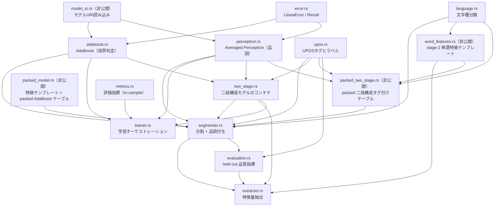

# モジュール設計

`litsea` ライブラリクレートは、それぞれ明確な責務を持つモジュールで構成されています。

## モジュール依存関係グラフ


```mermaid
graph TD
    language["language.rs<br/>文字種分類"]
    segmenter["segmenter.rs<br/>分割 + 品詞付与"]
    adaboost["adaboost.rs<br/>AdaBoost（境界判定）"]
    perceptron["perceptron.rs<br/>Averaged Perceptron（品詞）"]
    upos["upos.rs<br/>UPOSタグとラベル"]
    extractor["extractor.rs<br/>特徴量抽出"]
    trainer["trainer.rs<br/>学習オーケストレーション"]
    two_stage["two_stage.rs<br/>二段構成モデルのコンテナ"]
    word_features["word_features.rs（非公開）<br/>stage-2 単語特徴テンプレート"]
    packed_model["packed_model.rs（非公開）<br/>特徴テンプレート + packed AdaBoost テーブル"]
    packed_two_stage["packed_two_stage.rs（非公開）<br/>packed 二段構成タグ付けテーブル"]
    model_io["model_io.rs（非公開）<br/>モデルURI読み込み"]
    error["error.rs<br/>LitseaError / Result"]
    metrics["metrics.rs<br/>評価指標（in-sample）"]
    evaluation["evaluation.rs<br/>held-out 品質指標"]

    language --> segmenter
    upos --> segmenter
    adaboost --> segmenter
    perceptron --> segmenter
    packed_model --> segmenter
    packed_two_stage --> segmenter
    two_stage --> segmenter
    segmenter --> extractor
    two_stage --> extractor
    word_features --> extractor
    evaluation --> extractor
    adaboost --> trainer
    perceptron --> trainer
    two_stage --> trainer
    adaboost --> two_stage
    perceptron --> two_stage
    upos --> two_stage
    language --> word_features
    word_features --> packed_two_stage
    language --> packed_two_stage
    perceptron --> packed_two_stage
    upos --> packed_two_stage
    model_io --> adaboost
    model_io --> perceptron
    error --> adaboost
    error --> perceptron
    metrics --> trainer
    segmenter --> evaluation
    upos --> evaluation
```

## モジュール詳細

### `language.rs` -- 言語定義

`Language` enum と文字種分類を定義します。

- **`Language`** -- `Japanese`・`Chinese`・`Korean`・`English` のバリアントを持つ enum
  - `FromStr` を実装（`"japanese"`・`"ja"`・`"chinese"`・`"zh"`・`"korean"`・`"ko"`・`"english"`・`"en"` をパース）
  - `Display` を実装（小文字名を出力）
  - `char_type(c: char) -> &'static str` -- 非公開の `char_type_id()` が返す数値の type id に対するテーブル参照として文字を分類します。`char_type_id()` は言語別関数（`japanese_char_type_id` など）にディスパッチし、各関数は文字範囲に対する直接の `match` として実装されています（アロケーションなし・正規表現不使用）。言語別関数は、共通の `"P"`/`"A"`/`"N"` クラス用の `punct_latin_digit()` ヘルパーを共有します。

### `segmenter.rs` -- 単語分割と品詞付与

主要なユーザー向けモジュールです。

- **`Segmenter`** -- `Language` と `AdaBoost` 学習器を保持（フィールドは非公開。`language()`・`learner()`・`learner_mut()` を使用）。加えて、`segment()` が使うコンパイル済みスコアリングテーブルの内部キャッシュ（`packed`）と、オプションのコンパイル済み二段構成タグ付けモデル（`with_two_stage_learner` で設定。`segment_with_pos()` を支える。キャッシュとは異なり stage-2 モデルそのものであり、生の学習器パーツはコンパイル後に破棄される）も保持する
  - `new(language)` -- デフォルト（空）の AdaBoost 学習器付きでセグメンターを作成
  - `with_learner(language, learner)` -- 設定済みの AdaBoost 学習器（例: 学習済みモデルを読み込んだもの）付きでセグメンターを作成
  - `with_two_stage_learner(language, learner)` -- `TwoStageLearner` から二段構成の分割+品詞付与用セグメンターを作成
  - `segment(sentence)` -- テキストを単語に分割し `Vec<String>` を返す
  - `segment_into(sentence, buf)` -- アロケーションフリー版（#184）: 再利用可能な `SegmentBuffer` から借用したトークンのバイト範囲を返す
  - `segment_with_pos(sentence)` -- 分割と品詞付与を行い `Result<Vec<(String, Upos)>>` を返す（二段構成学習器が未設定の場合は `PosLearnerNotSet`）
  - `char_type(ch)` -- 1文字を種別コードに分類
  - `add_corpus(corpus)` / `add_corpus_tsv(corpus)` -- 学習データを追加（それぞれ空白区切り・タブ区切り/空白保持。後者は韓国語と英語で使用、issue #152 を参照）
  - `add_corpus_with_writer(corpus, callback)` / `add_corpus_with_pos_writer(corpus, callback)` / `add_corpus_tsv_with_writer(corpus, callback)` -- カスタムコールバックでコーパスを処理（POS writer 版は二段構成の stage-1 特徴量抽出が使用）

### `adaboost.rs` -- AdaBoost アルゴリズム

単語境界の判定に使う二値分類器です。

- **`AdaBoost`**
  - `new(threshold, num_iterations)` -- 学習パラメータを指定して作成
  - `initialize_features(path)` / `initialize_instances(path)` -- 学習データを読み込み
  - `train(running)` -- AdaBoost の学習ループを実行
  - `predict(&attributes)` -- 境界（+1）か非境界（-1）かを予測
  - `load_model(uri)`（async）/ `load_model_from_path(path)` / `load_model_from_reader(reader)` -- モデルの読み込み
  - `save_model(path)` -- モデルをファイルに保存
  - `metrics()` -- 正解率・適合率・再現率を計算（`BinaryMetrics`）
  - `bias()` -- モデルのバイアス項を取得

### `perceptron.rs` -- Averaged Perceptron

二段構成モデルの学習（両ステージ）と、同梱分割モデルの畳み込み（collapse）レシピを支える多クラス分類器です。

- **`AveragedPerceptron`**
  - `add_instance(features, label)` -- 学習インスタンスを追加
  - `train(num_epochs, running)` -- 重み平均化付きで学習（`running: &AtomicBool`）
  - `predict(&features)` -- 最良クラスのラベルを予測
  - `load_model(uri)`（async）/ `load_model_from_path(path)` / `load_model_from_reader(reader)` -- モデルの読み込み
  - `save_model(path)` -- モデルを保存
  - `metrics()` -- マクロ平均の評価指標（`MulticlassMetrics`）
- 重みは高速な推論のため「特徴 → クラス別ベクトル」レイアウトで保持します。

### `upos.rs` -- Universal POS タグ

- **`Upos`** -- Universal Dependencies の17品詞タグ（`NOUN`、`VERB`、...）
- **`SegmentLabel`** -- 文字位置ごとの分割+品詞の複合ラベル（`B(Upos)` または `O`）。`"B-NOUN"` / `"O"` 文字列形式の `Display`/`FromStr` を実装

### `extractor.rs` -- 特徴量抽出

モデル学習用にコーパスから特徴量を抽出します。

- **`Extractor`** -- `Segmenter` をラップしてコーパスファイルを処理
  - `new(language)` -- 言語を指定して作成
  - `extract(corpus_path, features_path)` -- コーパスを読み、特徴量ファイルを書き出す
  - `extract_tsv(corpus_path, features_path)` -- タブ区切り・空白保持コーパス版（issue #152、韓国語と英語で使用）
  - `extract_two_stage(corpus_path, output_prefix, feature_set)` -- 品詞付きコーパスから二段構成の学習特徴量（issue #147）を抽出: `{output_prefix}.stage1`（境界特徴量）、`.stage2`（単語レベル特徴量）、`.lexicon` を書き出す

### `trainer.rs` -- 学習オーケストレーション

高レベルの学習ワークフローです。

- **`Trainer`** -- 分割モデルの学習（AdaBoost）
  - `new(threshold, num_iterations, features_path)` -- 特徴量ファイルから初期化
  - `load_model(uri)` -- 増分学習用に既存モデルを読み込み（async・任意）
  - `train(running, model_path)` -- 学習・保存して `BinaryMetrics` を返す
- **`PerceptronTrainer`** -- 不透明な文字列ラベルに対する汎用の Averaged Perceptron 学習（同梱分割モデルの畳み込みレシピの学習ステップ）
  - `new(num_epochs, features_path)` / `load_model(uri)` / `train(running, model_path)`（`MulticlassMetrics` を返す）
- **`TwoStageTrainer`** -- 二段構成モデルの学習（issue #147）: `Extractor::extract_two_stage` が書き出したファイルから stage-1 境界分類器（`AveragedPerceptron`）と stage-2 単語タガーを学習し、stage-1 を AdaBoost 形式へ畳み込んでから `TwoStageLearner` を組み立てる
  - `new(num_epochs, dominance, features_prefix)` / `train(running, model_path)`（`TwoStageMetrics` を返す。完全な API は[Trainer](../litsea/trainer.md)を参照）
- **`TwoStageMetrics`** -- `TwoStageTrainer::train` 実行のステージごとの `MulticlassMetrics`（`stage1`・`stage2`）

### `two_stage.rs` -- 二段構成モデルのコンテナ

`litsea-two-stage v1` ファイル形式（[モデルファイル形式](../advanced/model-file-format.md)を参照）と、二段構成モデルをメモリ上に保持する型を定義します（issue #147）。

- **`TwoStageLearner`** -- stage-1 境界 `AdaBoost` モデル、stage-2 `AveragedPerceptron` 単語タガー、候補タグ語彙表（lexicon）をまとめる。`new()` / `from_parts(...)` / `load_model_from_path(path)` / `save_model(path)` は単一学習器の各型と同様の API
- **`TwoStageFeatureSet`** -- stage-2 の単語レベルテンプレート部分集合を選択する enum（`Fast`、`Balanced`、`Full`）
- **`ModelKind`** -- モデルファイルの形式をその 1 行目から検出する（`AdaBoost`、スタンドアロンの `AveragedPerceptron`、`TwoStage`）。種類違いのファイルに正確なローダーエラーを返すために使用される

### `error.rs` -- エラー処理

- **`LitseaError`** -- エラー enum（`Io`・`InvalidData`・`InvalidInput`・`Unsupported`・`PosLearnerNotSet`、`remote_model` フィーチャー時は `Download` も）。`#[non_exhaustive]` が付与されているため、外部の `match` 式にはワイルドカードアームが必要です
- **`Result<T>`** -- すべての失敗しうるAPIが使うエイリアス

### `metrics.rs` -- 評価指標

- **`BinaryMetrics`** -- 正解率・適合率・再現率・混同行列（AdaBoost）
- **`MulticlassMetrics`** -- 正解率とマクロ平均適合率/再現率（Averaged Perceptron）

### `evaluation.rs` -- held-out 評価指標

`metrics.rs` が in-sample 品質（`train` が出力する、学習データそのもので測った指標）を報告するのに対し、このモジュールは held-out 品質を計算します: 文字オフセットのスパンを使って `Segmenter` の出力を gold コーパスと比較するため、文中の他の箇所のトークン化の違いに関わらず、予測トークンと gold トークンを正確に対応付けられます。

- **`SegmentationMetrics`** -- 単語分割の単語/境界の適合率・再現率・F1。`evaluate_segmentation(segmenter, gold)` が生成
- **`PosMetrics`** -- `SegmentationMetrics` に加え、タグ付き単語の適合率・再現率・F1 を保持。`evaluate_pos(segmenter, gold)` が生成（失敗しうる: `segment_with_pos` のエラーを伝播）
- **`parse_gold_line(line, tsv)`** / **`parse_gold_pos_line(line)`** -- gold コーパスの行をトークン列にパース（プレーンまたは品詞付き）。二段構成の extractor・trainer からも使用される
- CLI の `litsea evaluate` サブコマンドを支える

### `packed_model.rs` -- 特徴テンプレートと packed AdaBoost テーブル（非公開）

宣言的な特徴テンプレートテーブル（`TEMPLATES`。全特徴量コンシューマの単一の真実の源）、モデルの特徴量文字列を packed 整数キーへ変換するロード時パーサ、そして `segment()` の 2 パススコアラーが読むマージ/密テーブルへ AdaBoost の重みをコンパイルした `PackedModel` を保持する内部モジュールです。公開APIには含まれません。

### `packed_two_stage.rs` -- packed 二段構成タグ付けテーブル（非公開）

`TwoStageLearner` の stage-2 タガーと語彙表を、`segment_with_pos()` が読む密/疎スコアリングテーブルへコンパイルする内部モジュールです。`packed_model.rs` が AdaBoost 学習器に対して行っていることの二段構成版に相当します: 語彙表とドミナンススキップ対象タグをカバーするサーフェスマップ、`word_features.rs` 由来の文字を含む単語特徴テンプレート用のクラス別スパース行、文字種・単語長テンプレート用の密テーブル、から構成されます。公開APIには含まれません。

### `word_features.rs` -- stage-2 単語特徴テンプレート（非公開）

二段構成タガーの stage-2 が使う単語レベルの特徴テンプレート（表層、単語長、先頭/末尾文字とその文字種、文脈文字/文字種/バイグラムなど）を定義する内部モジュールです。テンプレート集合の単一の真実の源であり、学習用の extractor（`extract_two_stage` 経由）が `write_word_features` で特徴量文字列を書き出し、`packed_two_stage.rs` が `parse_word_feature` で同じ文字列を整数キーへ逆変換します。両者はラウンドトリップテストで整合性が固定されています。公開APIには含まれません。

### `model_io.rs` -- モデル読み込みI/O（非公開）

モデルURI（プレーンパス、`file://`、`remote_model` フィーチャー時の `http(s)://`）を解決して生のモデルバイト列を返す内部モジュールです。公開APIには含まれません。

## 公開エクスポート

ライブラリの `lib.rs` は公開モジュールと主要型の再エクスポートを提供します:

```rust
pub mod adaboost;
pub mod error;
pub mod evaluation;
pub mod extractor;
pub mod language;
pub mod metrics;
mod model_io;
mod packed_model;
mod packed_two_stage;
pub mod perceptron;
pub mod segmenter;
pub mod trainer;
pub mod two_stage;
pub mod upos;
mod word_features;

pub use adaboost::AdaBoost;
pub use error::{LitseaError, Result};
pub use evaluation::{PosMetrics, SegmentationMetrics};
pub use extractor::Extractor;
pub use language::{Language, ParseLanguageError};
pub use metrics::{BinaryMetrics, MulticlassMetrics};
pub use perceptron::AveragedPerceptron;
pub use segmenter::{SegmentBuffer, Segmenter};
pub use trainer::{PerceptronTrainer, Trainer, TwoStageMetrics, TwoStageTrainer};
pub use two_stage::{
    ModelKind, ParseTwoStageFeatureSetError, TwoStageFeatureSet, TwoStageLearner,
};
pub use upos::{ParseSegmentLabelError, ParseUposError, SegmentLabel, Upos};

pub fn version() -> &'static str { ... }
```
