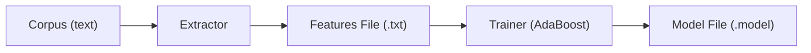
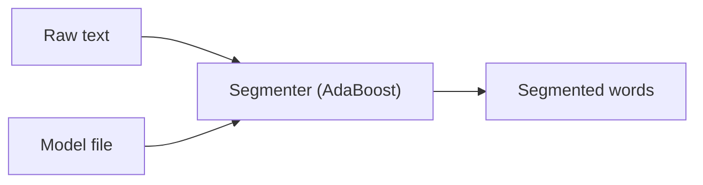

# アーキテクチャ概要

Litsea は、コンパクトで辞書不要の単語分割システムとして設計されています。単語分割を**二値分類問題**として扱い、文字レベルの特徴量から単語境界パターンを学習するために **AdaBoost** を使用します。

## 高レベルデータフロー

Litsea には**学習**と**分割**の 2 つの主要なワークフローがあります。

### 学習パイプライン

1. **コーパスの準備** -- 単語をスペースで区切ったテキストを準備
2. **特徴量抽出** -- `Extractor` がコーパスを読み込み、文字を種別に分類し、ラベル付き特徴量ベクトルを出力
3. **モデル学習** -- `Trainer` が特徴量を AdaBoost に入力し、最も情報量の多い特徴量を反復的に選択してコンパクトなモデルを生成

### 分割パイプライン

1. **モデル読み込み** -- 学習済みモデルを読み込み（ファイルまたは URL から）
2. **文字分類** -- 入力の各文字について、言語固有のパターンに基づいて文字種コードを決定
3. **特徴量抽出** -- スライディングウィンドウを使用して各文字位置の特徴量セットを構築
4. **予測** -- AdaBoost が各位置が単語境界かどうかを予測

## 設計原則

- **辞書不要** -- MeCab や Lindera とは異なり、Litsea は文字パターンから学習した統計モデルのみに依存
- **コンパクトなモデル** -- モデルファイルは通常 1-22 KB で、重要な特徴量の重みのみを含む
- **言語非依存のフレームワーク** -- コアアルゴリズムはすべての言語で共通であり、文字種パターンのみが異なる
- **簡単な拡張性** -- 新しい言語の追加には、文字種パターンの定義とモデルの学習のみが必要
