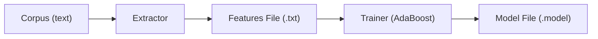
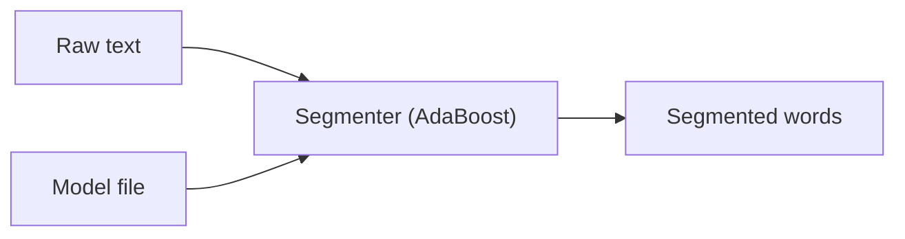

# アーキテクチャ概要

Litsea は、コンパクトで辞書不要の単語分割システムとして設計されています。単語分割を**二値分類問題**として扱い、文字レベルの特徴量から単語境界パターンを学習するために **AdaBoost** を使用します。

## 高レベルデータフロー

Litsea には**学習**と**分割**の 2 つの主要なワークフローがあります。

### 学習パイプライン

```mermaid
flowchart LR
    A["Corpus (text)"] --> B["Extractor"]
    B --> C["Features File (.txt)"]
    C --> D["Trainer (AdaBoost)"]
    D --> E["Model File (.model)"]
```

1. **コーパスの準備** -- 単語をスペースで区切ったテキストを準備
2. **特徴量抽出** -- `Extractor` がコーパスを読み込み、文字を種別に分類し、ラベル付き特徴量ベクトルを出力
3. **モデル学習** -- `Trainer` が特徴量を AdaBoost に入力し、最も情報量の多い特徴量を反復的に選択してコンパクトなモデルを生成

### 分割パイプライン

```mermaid
flowchart LR
    F["Raw text"] --> G["Segmenter (AdaBoost)"]
    H["Model file"] --> G
    G --> I["Segmented words"]
```

1. **モデル読み込み** -- 学習済みモデルを読み込み（ファイルまたは URL から）
2. **文字分類** -- 入力の各文字について、言語固有のパターンに基づいて文字種コードを決定
3. **特徴量抽出** -- スライディングウィンドウを使用し、再利用するバッファを通して各文字位置の文字 n-gram 特徴量をストリーム処理
4. **予測** -- AdaBoost が各位置が単語境界かどうかを予測

## 設計原則

- **辞書不要** -- MeCab や Lindera とは異なり、Litsea は文字パターンから学習した統計モデルのみに依存
- **コンパクトなモデル** -- レガシーな単語分割モデル（`RWCP.model`、`JEITA_Genpaku_ChaSen_IPAdic.model`）は約 16-22 KB。再学習された `japanese`/`chinese`/`korean.model` は約 86 KB〜2.0 MB で、[事前学習済みモデル](../pre-trained-models.md)に記載の品質向上とのトレードオフ。二段構成の品詞モデルは約 5-8 MB、分割 + 品詞付与の統合モデルは約 9-19 MB -- いずれもアプリケーションに直接埋め込める程度に小さく、重要な特徴量の重みのみを含む
- **言語非依存のフレームワーク** -- コアアルゴリズムはすべての言語で共通であり、文字種パターンのみが異なる
- **簡単な拡張性** -- 新しい言語の追加には、文字種パターンの定義とモデルの学習のみが必要
