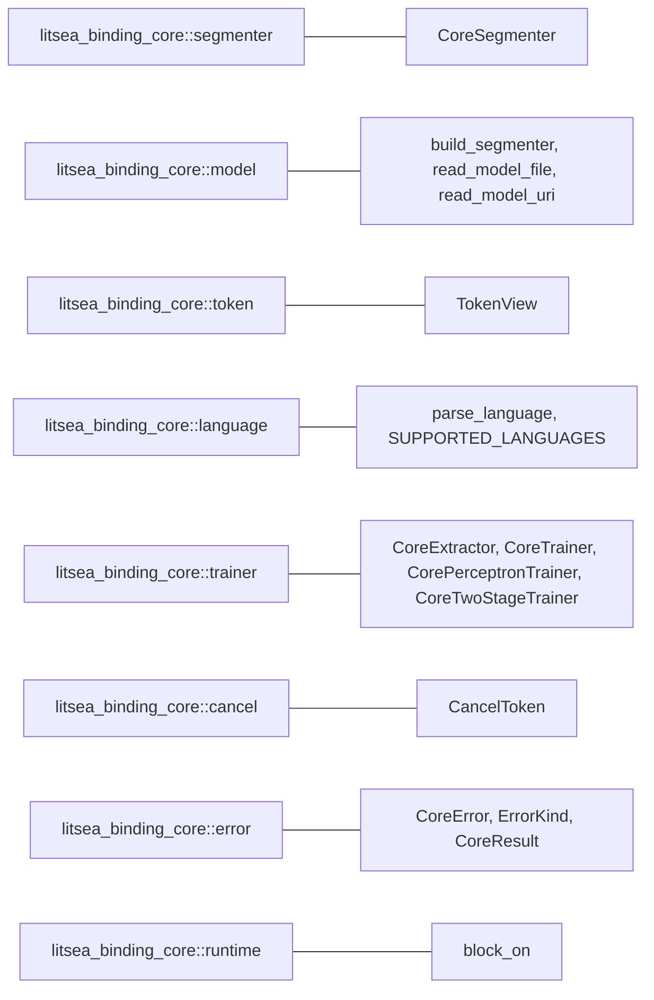

# litsea-binding-core

`litsea-binding-core` は、各言語バインディングが共有する FFI 非依存のロジックをまとめたクレートです。依存先は `litsea`（およびネイティブターゲットではブロッキング用の Tokio）のみで、PyO3・napi・ext-php-rs・magnus・wasm-bindgen には一切依存しません。そのため、ホスト言語のツールチェーンなしでユニットテストできます。

## インストール

```toml
[dependencies]
litsea-binding-core = "0.12.0"
```

## モジュール構成



| モジュール | 主な型 | 役割 |
|-----------|-------|------|
| `segmenter` | `CoreSegmenter` | 分割と POS タグ付け（単発・バッチ）。バッファを再利用する |
| `model` | `BuiltSegmenter`, `build_segmenter` | モデルの読み込みと種別判定 |
| `token` | `TokenView` | 表層形・バイトオフセット・UPOS タグ（任意）を持つトークン |
| `language` | `SUPPORTED_LANGUAGES`, `parse_language` | 言語名のパースと列挙 |
| `trainer` | `CoreExtractor`, `CoreTrainer`, `CorePerceptronTrainer`, `CoreTwoStageTrainer` | 特徴量抽出と学習（ネイティブターゲットのみ） |
| `cancel` | `CancelToken` | 学習の協調的キャンセル |
| `error` | `CoreError`, `ErrorKind`, `CoreResult` | 各言語の例外へ写像するためのエラー分類 |
| `runtime` | `block_on` | 同期ホストから非同期モデルローダを呼ぶ（ネイティブターゲットのみ） |

## 分割

```rust
use litsea::Language;
use litsea_binding_core::CoreSegmenter;

let segmenter = CoreSegmenter::from_path(Language::Japanese, "models/japanese.model".as_ref())?;

assert_eq!(
    segmenter.segment("これはテストです。"),
    vec!["これ", "は", "テスト", "です", "。"]
);
```

空白区切りの言語では空白自体が 1 トークンとして返るため、トークンを連結すると入力が正確に復元されます。例えば `korean.model` は `"안녕하세요 반갑습니다"` を `["안녕하세요", " ", "반갑습니다"]` に分割します。

`CoreSegmenter` は `Arc<Segmenter>` と `Mutex<SegmentBuffer>` を保持します。`Segmenter` は `Send + Sync` であり、モデル読み込み済みのインスタンスは packed テーブルが構築済みのため、並行した `segment` 呼び出しは内部の read ロックしか取りません。ミューテックスが保護するのはスクラッチバッファだけです。したがって 1 つのインスタンスをスレッド間で共有し、継続的に再利用できます（各バインディングはそのように使います）。

| メソッド | 戻り値 |
|---------|-------|
| `segment(text)` | `Vec<String>` |
| `segment_batch(texts)` | `Vec<Vec<String>>`（バッファを 1 つ再利用） |
| `segment_tokens(text)` | バイトオフセット付き `Vec<TokenView>`（`pos` は未設定） |
| `segment_with_pos(text)` | バイトオフセットと UPOS タグ付き `CoreResult<Vec<TokenView>>` |
| `segment_with_pos_batch(texts)` | `CoreResult<Vec<Vec<TokenView>>>` |

バイトオフセットは厳密です。トークンは入力を隙間も重複もなく覆うため、すべてのトークンについて `&text[token.byte_start..token.byte_end] == token.surface` が成り立ちます。空白を保持する韓国語・英語でも同様です。

なお `segment_with_pos_batch` は `segment_batch` のようにアロケーションを償却できません。`litsea` に `segment_with_pos` のバッファ再利用版が存在しないためです。

## モデルの読み込み

| コンストラクタ | 利用可否 |
|---------------|---------|
| `CoreSegmenter::from_bytes(language, bytes)` | wasm32 を含むすべての環境 |
| `CoreSegmenter::from_path(language, path)` | ネイティブターゲット |
| `CoreSegmenter::from_uri(language, uri).await` | すべての環境（`http(s)://` は `remote_model` feature が必要） |
| `CoreSegmenter::from_uri_blocking(language, uri)` | ネイティブターゲット |

いずれも `build_segmenter` を経由し、モデルファイル自身から何を構築するかを決定します。

| 判定された種別 | 結果 |
|--------------|------|
| 二段構成モデル（`litsea-two-stage v1`） | POS 対応セグメンタ、`has_pos() == true` |
| AdaBoost 形式モデル | 分割専用セグメンタ、`has_pos() == false` |
| joint POS モデル（旧形式） | joint モデルが削除済みであることを説明する `ErrorKind::Model` エラー |

バイト列を 1 度読んでから分岐するため、リモートモデルのダウンロードは 1 回で済みます。

## エラー

`CoreError` は `ErrorKind` とメッセージを持ちます。種別は安定した文字列で、ホスト言語へそのまま公開することを想定しています。

| 種別 | `as_str()` | 発生条件 |
|------|-----------|---------|
| `InvalidArgument` | `invalid_argument` | 未知の言語名、未知の feature set、使用済みトレーナ |
| `Model` | `model` | ダウンロード失敗、または種別の異なるモデル |
| `Io` | `io` | ファイルの読み書き失敗 |
| `Parse` | `parse` | モデルまたは学習データの形式不正 |
| `Unsupported` | `unsupported` | このビルドでは利用できないスキームや操作 |
| `PosUnavailable` | `pos_unavailable` | 分割専用モデルに対して POS タグ付けを要求した |
| `Runtime` | `runtime` | 上記以外 |

この一覧は `remote_model` feature の有無で変化しないため、バインディング側の例外階層は固定できます。

## 学習

ネイティブターゲットのみで利用できます。特徴量抽出と学習はファイル入出力を前提としているためです。

```rust
use litsea::Language;
use litsea_binding_core::{CancelToken, CoreExtractor, CoreTrainer, CorpusFormat};

CoreExtractor::new(Language::Japanese).extract(
    "corpus.txt".as_ref(),
    "features.txt".as_ref(),
    CorpusFormat::PlainText,
    false, // tag_free
)?;

let metrics = CoreTrainer::new(0.01, 10_000, "features.txt".as_ref())?
    .train(&CancelToken::new(), "japanese.model".as_ref())?;
println!("accuracy: {:.2}%", metrics.accuracy);
```

`CoreTwoStageTrainer` は CLI の `train --pos` に対応します。`litsea` の `TwoStageTrainer::train` がトレーナを消費する（stage 1 は AdaBoost モデルへ collapse されるため、その場での再学習ができない）ため、このトレーナは 1 度しか使えません。2 回目の呼び出しは `InvalidArgument` エラーを返し、`is_available()` で状態を確認できます。

### キャンセルの挙動

キャンセルは協調的であり、**エラーではありません**。

- トレーナは次のチェックポイントで停止し、
- 部分的に学習されたモデルは指定パスへ保存され、
- メトリクスが通常どおり返されます。

チェックは AdaBoost 学習ではブースティング反復ごと、パーセプトロン学習ではエポックごと・インスタンスごとに行われるため、パーセプトロン学習の方が反応がはるかに速くなります。`CancelToken` のクローンは同じフラグを共有するので、バックグラウンドスレッドに渡したトークンから、別スレッドが実行中の学習を停止できます。

## プラットフォームサポート

`wasm32-unknown-unknown` では `trainer`・`runtime`・`read_model_file`・`CoreSegmenter::from_path` はコンパイル対象から外れます。wasm32 にはファイルシステムもブロッキングランタイムも存在しないためです。WASM から使う場合は、JavaScript 側でモデルのバイト列を取得し `CoreSegmenter::from_bytes` に渡してください。

## Feature

| Feature | 既定 | 効果 |
|---------|------|------|
| `remote_model` | 無効 | `litsea/remote_model` を有効化し、`http(s)://` のモデル URI を解決できるようにする |
