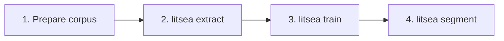

# CLIリファレンス概要

`litsea` CLIは、単語分割、モデル学習、テキスト処理のためのコマンドを提供します。

## 使い方

```sh
litsea <COMMAND> [OPTIONS] [ARGS]
```

## コマンド一覧

| Command | Description |
|---------|------------|
| [`extract`](extract.md) | 学習用にコーパスから特徴量を抽出 |
| [`train`](train.md) | 単語分割モデルを学習 |
| [`segment`](segment.md) | 学習済みモデルを使用してテキストを単語に分割 |
| [`split-sentences`](split-sentences.md) | Unicode UAX #29を使用してテキストを文に分割 |

## グローバルオプション

| Option | Description |
|--------|------------|
| `-h`, `--help` | ヘルプ情報を表示 |
| `-V`, `--version` | バージョン番号を表示 |

## 一般的なワークフロー



1. 単語をスペースで区切ったコーパスを用意する
2. 特徴量を抽出する: `litsea extract -l japanese corpus.txt features.txt`
3. モデルを学習する: `litsea train -t 0.005 -i 1000 features.txt model.model`
4. テキストを分割する: `echo "text" | litsea segment -l japanese model.model`
