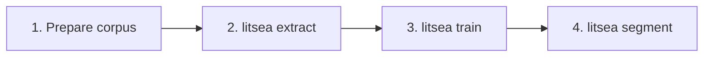
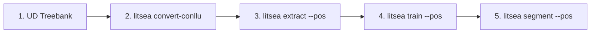

# CLIリファレンス概要

`litsea` CLIは、単語分割、モデル学習、テキスト処理のためのコマンドを提供します。

## 使い方

```sh
litsea <COMMAND> [OPTIONS] [ARGS]
```

## コマンド一覧

| Command | Description |
|---------|------------|
| [`extract`](extract.md) | 学習用にコーパスから特徴量を抽出 |
| [`train`](train.md) | 単語分割モデルを学習 |
| [`segment`](segment.md) | 学習済みモデルを使用してテキストを単語に分割 |
| [`split-sentences`](split-sentences.md) | Unicode UAX #29を使用してテキストを文に分割 |
| [`convert-conllu`](convert-conllu.md) | CoNLL-U（Universal Dependencies）形式をLitsea品詞コーパス形式に変換 |

## グローバルオプション

| Option | Description |
|--------|------------|
| `-h`, `--help` | ヘルプ情報を表示 |
| `-V`, `--version` | バージョン番号を表示 |

## 一般的なワークフロー

### AdaBoost ワークフロー（単語分割のみ）


```mermaid
flowchart LR
    A["1. Prepare corpus"] --> B["2. litsea extract"]
    B --> C["3. litsea train"]
    C --> D["4. litsea segment"]
```

1. 単語をスペースで区切ったコーパスを用意する
2. 特徴量を抽出する: `litsea extract -l japanese corpus.txt features.txt`
3. モデルを学習する: `litsea train -t 0.005 -i 1000 features.txt model.model`
4. テキストを分割する: `echo "text" | litsea segment -l japanese model.model`

### POS ワークフロー（品詞推定付き単語分割）


```mermaid
flowchart LR
    A["1. UD Treebank"] --> B["2. litsea convert-conllu"]
    B --> C["3. litsea extract --pos"]
    C --> D["4. litsea train --pos"]
    D --> E["5. litsea segment --pos"]
```

1. Universal Dependencies Treebank（例: UD\_Japanese-GSD）を取得する
2. CoNLL-U 形式を変換する: `litsea convert-conllu input.conllu corpus_pos.txt`
3. 品詞付き特徴量を抽出する: `litsea extract --pos -l japanese corpus_pos.txt features_pos.txt`
4. POS モデルを学習する: `litsea train --pos --num-epochs 10 features_pos.txt model_pos.model`
5. 品詞推定付き分割: `echo "text" | litsea segment --pos -l japanese model_pos.model`
