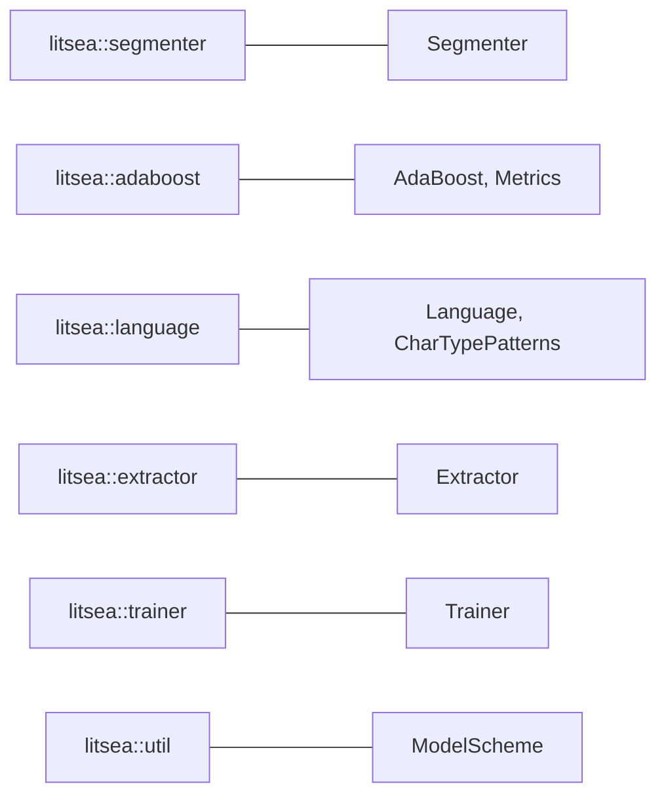

# ライブラリ API 概要

`litsea` クレートは、単語分割、モデル学習、特徴量抽出のための Rust API を提供します。

## インストール

```toml
[dependencies]
litsea = "0.4.0"
tokio = { version = "1", features = ["rt-multi-thread", "macros"] }
```

## モジュール構成



| モジュール | 主要な型 | 用途 |
|--------|--------------|---------|
| `litsea::segmenter` | `Segmenter` | 単語分割 |
| `litsea::adaboost` | `AdaBoost`, `Metrics` | 二値分類、モデルの入出力 |
| `litsea::language` | `Language`, `CharTypePatterns` | 言語定義、文字分類 |
| `litsea::extractor` | `Extractor` | コーパスからの特徴量抽出 |
| `litsea::trainer` | `Trainer` | 学習パイプラインの制御 |
| `litsea::util` | `ModelScheme` | URI スキームの解析 |

## クイックスタート

```rust
use litsea::adaboost::AdaBoost;
use litsea::language::Language;
use litsea::segmenter::Segmenter;

#[tokio::main]
async fn main() -> Result<(), Box<dyn std::error::Error>> {
    let mut learner = AdaBoost::new(0.01, 100);
    learner.load_model("./resources/japanese.model").await?;

    let segmenter = Segmenter::new(Language::Japanese, Some(learner));
    let tokens = segmenter.segment("これはテストです。");

    assert_eq!(tokens, vec!["これ", "は", "テスト", "です", "。"]);
    Ok(())
}
```

## API ドキュメント

完全な API ドキュメントは [docs.rs/litsea](https://docs.rs/litsea) で参照できます。
