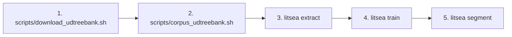
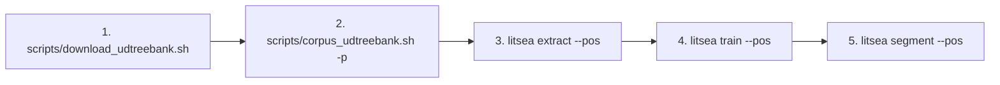
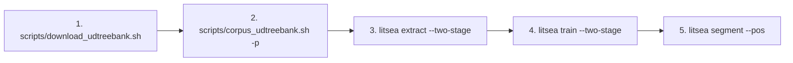

# CLIリファレンス概要

`litsea` CLIは、単語分割、モデル学習、テキスト処理のためのコマンドを提供します。

CLI バイナリはライブラリの `remote_model` フィーチャーを有効にしてビルドされているため、`http(s)://` のモデル URI を追加設定なしでそのまま利用できます。一方、`litsea` ライブラリ自体はデフォルトフィーチャーにリモート読み込みを含みません。

## 使い方

```sh
litsea <COMMAND> [OPTIONS] [ARGS]
```

## コマンド一覧

| Command | Description |
|---------|------------|
| [`extract`](litsea-cli/extract.md) | 学習用にコーパスから特徴量を抽出 |
| [`train`](litsea-cli/train.md) | 単語分割モデルを学習 |
| [`segment`](litsea-cli/segment.md) | 学習済みモデルを使用してテキストを単語に分割 |
| [`evaluate`](litsea-cli/evaluate.md) | held-out のゴールドコーパスに対してモデルを評価 |

## グローバルオプション

| Option | Description |
|--------|------------|
| `-h`, `--help` | ヘルプ情報を表示 |
| `-V`, `--version` | バージョン番号を表示 |

## 一般的なワークフロー

### AdaBoost ワークフロー（単語分割のみ）


```mermaid
flowchart LR
    A["1. scripts/download_udtreebank.sh"] --> B["2. scripts/corpus_udtreebank.sh"]
    B --> C["3. litsea extract"]
    C --> D["4. litsea train"]
    D --> E["5. litsea segment"]
```

1. UD Treebank をダウンロードする: `conllu_file=$(bash scripts/download_udtreebank.sh -l ja -o /tmp)`
2. コーパスを準備する: `bash scripts/corpus_udtreebank.sh "$conllu_file" corpus.txt`
3. 特徴量を抽出する: `litsea extract -l japanese corpus.txt features.txt`
4. モデルを学習する: `litsea train -t 0.0001 -i 20000 features.txt model.model`
5. テキストを分割する: `echo "text" | litsea segment -l japanese model.model`

### POS ワークフロー（品詞推定付き単語分割）


```mermaid
flowchart LR
    A["1. scripts/download_udtreebank.sh"] --> B["2. scripts/corpus_udtreebank.sh -p"]
    B --> C["3. litsea extract --pos"]
    C --> D["4. litsea train --pos"]
    D --> E["5. litsea segment --pos"]
```

1. UD Treebank をダウンロードする: `conllu_file=$(bash scripts/download_udtreebank.sh -l ja -o /tmp)`
2. 品詞付きコーパスを準備する: `bash scripts/corpus_udtreebank.sh -p "$conllu_file" pos_corpus.txt`
3. 品詞付き特徴量を抽出する: `litsea extract --pos -l japanese pos_corpus.txt features_pos.txt`
4. POS モデルを学習する: `litsea train --pos --num-epochs 10 features_pos.txt model_pos.model`
5. 品詞推定付き分割: `echo "text" | litsea segment --pos -l japanese model_pos.model`

### 二段構成ワークフロー（高速な品詞推定）


```mermaid
flowchart LR
    A["1. scripts/download_udtreebank.sh"] --> B["2. scripts/corpus_udtreebank.sh -p"]
    B --> C["3. litsea extract --two-stage"]
    C --> D["4. litsea train --two-stage"]
    D --> E["5. litsea segment --pos"]
```

1. UD Treebank をダウンロードする: `conllu_file=$(bash scripts/download_udtreebank.sh -l ja -o /tmp)`
2. 品詞付きコーパスを準備する: `bash scripts/corpus_udtreebank.sh -p "$conllu_file" pos_corpus.txt`
3. 二段構成の特徴量を抽出する: `litsea extract --two-stage -l japanese pos_corpus.txt features_prefix`
4. 二段構成モデルを学習する: `litsea train --two-stage --num-epochs 50 features_prefix model.model`
5. 品詞推定付き分割: `echo "text" | litsea segment --pos -l japanese model.model`

`segment --pos` と `evaluate --pos` はファイルヘッダから二段構成モデルを
自動判別するため、学習後の利用に追加のフラグは不要です。アーキテクチャと
新規用途で推奨する理由については
[二段構成 vs Joint タグ付け](algorithm/two-stage-tagging.md)を、フラグの
完全なリファレンスは
[モデルの学習](training-guide/training-models.md#二段構成モデルの学習)や
[`train`](litsea-cli/train.md#二段構成モデルの学習)を参照してください。
