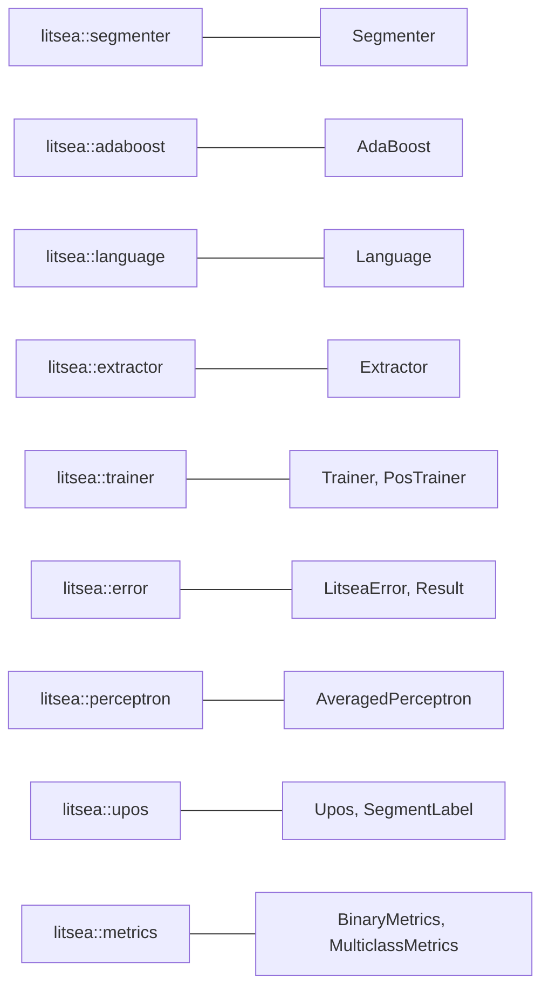

# ライブラリ API 概要

`litsea` クレートは、単語分割、モデル学習、特徴量抽出のための Rust API を提供します。

## インストール

```toml
[dependencies]
litsea = "0.5.0"
```

ローカルファイルからのモデル読み込みは同期 API（`load_model_from_path`）で行えるため、tokio などの非同期ランタイムは不要です。HTTP(S) からのリモートモデル取得など async API（`load_model`）を使う場合のみ、非同期ランタイムを追加してください。

## モジュール構成



| モジュール | 主要な型 | 用途 |
|--------|--------------|---------|
| `litsea::segmenter` | `Segmenter` | 単語分割、品詞推定付き分割 |
| `litsea::adaboost` | `AdaBoost` | 二値分類、モデルの入出力 |
| `litsea::perceptron` | `AveragedPerceptron` | 多クラス分類（品詞推定）、モデルの入出力 |
| `litsea::upos` | `Upos`, `SegmentLabel` | UPOS 品詞タグ、セグメントラベル |
| `litsea::language` | `Language` | 言語定義、文字分類 |
| `litsea::extractor` | `Extractor` | コーパスからの特徴量抽出 |
| `litsea::trainer` | `Trainer`, `PosTrainer` | 学習パイプラインの制御 |
| `litsea::error` | `LitseaError`, `Result` | エラー型と `Result` エイリアス |
| `litsea::metrics` | `BinaryMetrics`, `MulticlassMetrics` | 学習結果の評価指標 |

主要な型はすべてクレートルートから再エクスポートされているため、`use litsea::{AdaBoost, Language, Segmenter};` のように短いパスで利用できます。

## クイックスタート

```rust
use std::path::Path;

use litsea::{AdaBoost, Language, Segmenter};

fn main() -> litsea::Result<()> {
    let mut learner = AdaBoost::new(0.01, 100);
    learner.load_model_from_path(Path::new("./models/japanese.model"))?;

    let segmenter = Segmenter::new(Language::Japanese, Some(learner));
    let tokens = segmenter.segment("これはテストです。");

    assert_eq!(tokens, vec!["これ", "は", "テスト", "です", "。"]);
    Ok(())
}
```

## クイックスタート（品詞推定）

```rust
use std::path::Path;

use litsea::language::Language;
use litsea::perceptron::AveragedPerceptron;
use litsea::segmenter::Segmenter;

fn main() -> litsea::Result<()> {
    let mut pos_learner = AveragedPerceptron::new();
    pos_learner.load_model_from_path(Path::new("./models/japanese_pos.model"))?;

    let segmenter = Segmenter::with_pos_learner(Language::Japanese, pos_learner);
    let tokens = segmenter.segment_with_pos("これはテストです。");

    for (word, pos) in &tokens {
        print!("{}/{} ", word, pos);
    }
    println!();

    Ok(())
}
```

## API ドキュメント

完全な API ドキュメントは [docs.rs/litsea](https://docs.rs/litsea) で参照できます。
