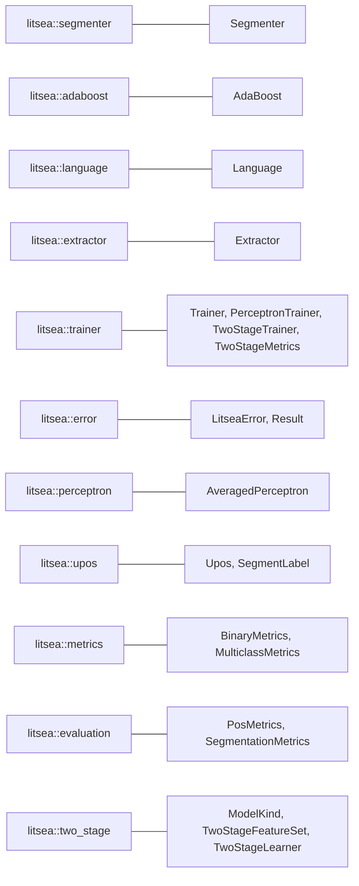

# ライブラリ API 概要

`litsea` クレートは、単語分割、モデル学習、特徴量抽出のための Rust API を提供します。

## インストール

```toml
[dependencies]
litsea = "0.12.0"
```

ローカルファイルからのモデル読み込みは同期 API（`load_model_from_path`）で行えるため、tokio などの非同期ランタイムは不要です。HTTP(S) からのリモートモデル取得など async API（`load_model`）を使う場合のみ、非同期ランタイムを追加してください（例えば `TwoStageLearner::load_model` も常に同じ非同期経路でモデル URI を解決するため、これに該当します）。

## モジュール構成


```mermaid
graph LR
    A["litsea::segmenter"] --- B["Segmenter"]
    C["litsea::adaboost"] --- D["AdaBoost"]
    E["litsea::language"] --- F["Language"]
    G["litsea::extractor"] --- H["Extractor"]
    I["litsea::trainer"] --- J["Trainer, PerceptronTrainer, TwoStageTrainer, TwoStageMetrics"]
    K["litsea::error"] --- L["LitseaError, Result"]
    M["litsea::perceptron"] --- N["AveragedPerceptron"]
    O["litsea::upos"] --- P["Upos, SegmentLabel"]
    Q["litsea::metrics"] --- R["BinaryMetrics, MulticlassMetrics"]
    S["litsea::evaluation"] --- T["PosMetrics, SegmentationMetrics"]
    U["litsea::two_stage"] --- V["ModelKind, TwoStageFeatureSet, TwoStageLearner"]
```

| モジュール | 主要な型 | 用途 |
|--------|--------------|---------|
| `litsea::segmenter` | `Segmenter`, `SegmentBuffer` | 単語分割（所有出力またはアロケーションフリー出力）、二段構成の品詞推定付き分割 |
| `litsea::adaboost` | `AdaBoost` | 二値分類、モデルの入出力 |
| `litsea::perceptron` | `AveragedPerceptron` | 多クラス分類（二段構成の学習）、モデルの入出力 |
| `litsea::upos` | `Upos`, `SegmentLabel` | UPOS 品詞タグ、セグメントラベル |
| `litsea::language` | `Language` | 言語定義、文字分類 |
| `litsea::extractor` | `Extractor` | コーパスからの特徴量抽出 |
| `litsea::trainer` | `Trainer`, `PerceptronTrainer`, `TwoStageTrainer`, `TwoStageMetrics` | 学習パイプラインの制御 |
| `litsea::error` | `LitseaError`, `Result` | エラー型と `Result` エイリアス |
| `litsea::metrics` | `BinaryMetrics`, `MulticlassMetrics` | 学習結果の評価指標(in-sample) |
| `litsea::evaluation` | `PosMetrics`, `SegmentationMetrics` | gold コーパスに対する held-out 評価 |
| `litsea::two_stage` | `ModelKind`, `TwoStageFeatureSet`, `TwoStageLearner` | 二段構成モデルのコンテナとモデル種別の判定 |

主要な型はすべてクレートルートから再エクスポートされているため、`use litsea::Segmenter;` は `use litsea::segmenter::Segmenter;` の短縮形として使えます。

## クイックスタート

```rust
use std::path::Path;

use litsea::adaboost::AdaBoost;
use litsea::language::Language;
use litsea::segmenter::Segmenter;

fn main() -> litsea::Result<()> {
    let mut learner = AdaBoost::new(0.01, 100);
    learner.load_model_from_path(Path::new("./models/RWCP.model"))?;

    let segmenter = Segmenter::with_learner(Language::Japanese, learner);
    let tokens = segmenter.segment("これはテストです。");

    assert_eq!(tokens, vec!["これ", "は", "テスト", "です", "。"]);
    Ok(())
}
```

## クイックスタート（品詞推定）

```rust
use std::path::Path;

use litsea::language::Language;
use litsea::segmenter::Segmenter;
use litsea::two_stage::TwoStageLearner;

fn main() -> litsea::Result<()> {
    let mut learner = TwoStageLearner::new();
    learner.load_model_from_path(Path::new("./models/japanese_two_stage.model"))?;

    let segmenter = Segmenter::with_two_stage_learner(Language::Japanese, learner);
    let tokens = segmenter.segment_with_pos("これはテストです。")?;

    for (word, pos) in &tokens {
        print!("{}/{} ", word, pos);
    }
    println!();

    Ok(())
}
```

完全な API ドキュメントは [docs.rs/litsea](https://docs.rs/litsea) で参照できます。
