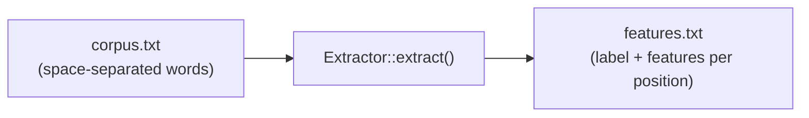

# Extractor

`Extractor` 構造体は、モデル学習用にコーパスファイルから特徴量を抽出します。

## 定義

```rust
pub struct Extractor {
    segmenter: Segmenter,
}
```

## コンストラクタ

### `Extractor::new`

```rust
pub fn new(language: Language) -> Self
```

指定した言語に対応する新しい Extractor を作成します。内部的に、学習済みモデルを持たない `Segmenter` を作成します。`Extractor` は `Default` も実装しており、`Extractor::new(Language::Japanese)` と等価です。

```rust
use litsea::extractor::Extractor;
use litsea::language::Language;

let extractor = Extractor::new(Language::Japanese);
```

抽出メソッドは `&self` を取るため、束縛を可変（`mut`）にする必要はありません。

## メソッド

### `extract`

```rust
pub fn extract(
    &self,
    corpus_path: &Path,
    features_path: &Path,
) -> litsea::Result<()>
```

コーパスファイル（スペース区切りの単語、1行1文）を読み込み、抽出した特徴量を出力ファイルに書き込みます。

```rust
use std::path::Path;

extractor.extract(
    Path::new("./corpus.txt"),
    Path::new("./features.txt"),
)?;
```

### パイプライン



Extractor は以下の処理を行います:

1. コーパスファイルから各行を読み込む
2. `Segmenter::add_corpus_with_writer()` を呼び出して各行を処理する
3. 各文字位置のラベルと特徴量セットを出力ファイルに書き込む

### `extract_tsv`

```rust
pub fn extract_tsv(
    &self,
    corpus_path: &Path,
    features_path: &Path,
) -> litsea::Result<()>
```

タブ区切りのコーパスファイル（トークンをタブで区切り、1行1文。トークンとして空白文字そのもの（`" "`）を含められます）を読み込み、抽出した特徴量を書き込みます。保持された空白により、モデルは空白文字を境界のコンテキストとして学習できます — 韓国語モデルおよび英語モデルの学習に使用されています（issue #152）。出力形式は `extract` と同一です。

```rust
use std::path::Path;

extractor.extract_tsv(
    Path::new("./ko_corpus.tsv"),
    Path::new("./ko_features.txt"),
)?;
```

### `extract_tag_free` / `extract_tsv_tag_free`

```rust
pub fn extract_tag_free(
    &self,
    corpus_path: &Path,
    features_path: &Path,
) -> litsea::Result<()>

pub fn extract_tsv_tag_free(
    &self,
    corpus_path: &Path,
    features_path: &Path,
) -> litsea::Result<()>
```

`extract` / `extract_tsv` のタグなし版です（issue #183）: 入力・出力形式は
同一ですが、16 個のタグ依存テンプレート（`UP*`/`BP*`/`UQ*`/`BQ*`/`TQ*`。
直前の境界判定結果を参照する）を全行から除外します。この特徴量で学習した
モデルは *pointwise* になり、`segment()` は逐次スコアリングパスを丸ごと
スキップします。同梱の `korean.model`/`english.model` はこの方法で学習されています。
言語別の品質・速度トレードオフの実測値は
[タグなし（pointwise）モデル](../pre-trained-models.md#タグなしpointwiseモデル)
を参照してください。CLI の `extract --tag-free` の実体です。

### `extract_two_stage`

```rust
pub fn extract_two_stage(
    &self,
    corpus_path: &Path,
    output_prefix: &Path,
    feature_set: TwoStageFeatureSet,
) -> litsea::Result<()>
```

POS タグ付きコーパス（`word/POS word/POS ...`、1行1文、POS タグは UPOS タグセット）を1パスで読み込み、[二段構成モデル](../algorithm/two-stage-tagging.md)の学習に使う [`TwoStageTrainer`](trainer.md#twostagetrainer) 用の3ファイルを `output_prefix` から書き出します。

- `{output_prefix}.stage1` -- 境界特徴量（`label\tfeature1\t...`、ラベルは `B` または `O`）。通常の抽出と同じ文字レベルの特徴量テンプレートを使用し、先頭位置を含む全位置で出力
- `{output_prefix}.stage2` -- 単語単位の特徴量（`label\tfeature1\t...`、ラベルは UPOS タグ）。`feature_set` で選択したテンプレートを使用（詳細は下記の [`TwoStageFeatureSet`](#twostagefeatureset)）
- `{output_prefix}.lexicon` -- 候補タグ語彙表（`surface\tTAG:count[,TAG:count...]`、出現頻度の高い順）

`TwoStageTrainer::new` は同じプレフィックスから同じ3つのパスを読み込みます。

```rust
use std::path::Path;

use litsea::TwoStageFeatureSet;

extractor.extract_two_stage(
    Path::new("./pos_corpus.txt"),
    Path::new("./pos_features"),
    TwoStageFeatureSet::Fast,
)?;
```

## in-memory での抽出

`extract*` の各メソッドには `*_to_writer` の対応版があり、コーパスを文字列で受け取り、特徴量行を任意の `Write` へ書き出します。ファイルシステムのない環境（WebAssembly）や、コーパスが既にメモリ上にある場合のためのものです。出力はパス版とバイト単位で一致します。

| パス版 | in-memory 版 |
|--------|-------------|
| `extract(corpus_path, features_path)` | `extract_to_writer(corpus, writer)` |
| `extract_tsv` | `extract_tsv_to_writer` |
| `extract_tag_free` | `extract_tag_free_to_writer` |
| `extract_tsv_tag_free` | `extract_tsv_tag_free_to_writer` |
| `extract_two_stage(corpus_path, prefix, feature_set)` | `extract_two_stage_to_writers(corpus, stage1, stage2, lexicon, feature_set)` |
| `extract_two_stage_tsv` | `extract_two_stage_tsv_to_writers` |

```rust
use litsea::{Extractor, Language};

let extractor = Extractor::new(Language::Japanese);
let corpus = "これ は テスト です 。\n";

let mut features = Vec::new();
extractor.extract_to_writer(corpus, &mut features)?;
```

二段構成版は、パス版が `{prefix}.stage1`・`.stage2`・`.lexicon` に書き出す 3 つの出力をそのまま writer へ書きます。

```rust
let (mut stage1, mut stage2, mut lexicon) = (Vec::new(), Vec::new(), Vec::new());
extractor.extract_two_stage_to_writers(
    corpus,
    &mut stage1,
    &mut stage2,
    &mut lexicon,
    TwoStageFeatureSet::Fast,
)?;
```

結果は [`TwoStageTrainer::from_features`](trainer.md#in-memory-での学習) に渡せます。

パス版は `wasm32-unknown-unknown` では利用できません（ファイルシステムが無いため）。`*_to_writer` 版はすべてのターゲットで利用できます。

## TwoStageFeatureSet

```rust
pub enum TwoStageFeatureSet {
    Full,
    Balanced,
    #[default]
    Fast,
}
```

[`extract_two_stage`](#extract_two_stage) が書き出す stage-2 の単語単位テンプレートを選択します（テンプレートの全カタログは[単語単位の特徴量テンプレート](../algorithm/feature-extraction.md)を参照）。タグ付け品質とスループットのトレードオフになります:

- `Full` -- すべての単語テンプレート（品質重視）
- `Balanced` -- `Fast` のテンプレートに加えて、先頭/末尾文字そのものと単語の文字種文字列
- `Fast`（既定） -- 実測に基づく最小構成: 表層、単語長、先頭/末尾文字種、隣接文脈文字とその文字種、2文字の接頭辞/接尾辞

`Display`（小文字: `"full"`、`"balanced"`、`"fast"`）と `FromStr`（不正な文字列には `ParseTwoStageFeatureSetError` を返す）も実装しています -- これは `--stage2-features` CLI フラグが受け付けるのと同じ名前です。[特徴量の抽出](../training-guide/extracting-features.md)を参照してください。
