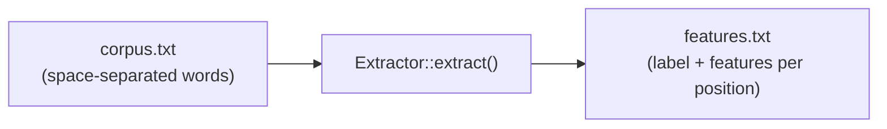

# Extractor

`Extractor` 構造体は、モデル学習用にコーパスファイルから特徴量を抽出します。

## 定義

```rust
pub struct Extractor {
    segmenter: Segmenter,
}
```

## コンストラクタ

### `Extractor::new`

```rust
pub fn new(language: Language) -> Self
```

指定した言語に対応する新しい Extractor を作成します。内部的に、学習済みモデルを持たない `Segmenter` を作成します。`Extractor` は `Default` も実装しており、`Extractor::new(Language::Japanese)` と等価です。

```rust
use litsea::extractor::Extractor;
use litsea::language::Language;

let extractor = Extractor::new(Language::Japanese);
```

抽出メソッドは `&self` を取るため、束縛を可変（`mut`）にする必要はありません。

## メソッド

### `extract`

```rust
pub fn extract(
    &self,
    corpus_path: &Path,
    features_path: &Path,
) -> litsea::Result<()>
```

コーパスファイル（スペース区切りの単語、1行1文）を読み込み、抽出した特徴量を出力ファイルに書き込みます。

```rust
use std::path::Path;

extractor.extract(
    Path::new("./corpus.txt"),
    Path::new("./features.txt"),
)?;
```

### パイプライン



Extractor は以下の処理を行います:

1. コーパスファイルから各行を読み込む
2. `Segmenter::add_corpus_with_writer()` を呼び出して各行を処理する
3. 各文字位置のラベルと特徴量セットを出力ファイルに書き込む

### `extract_with_pos`

```rust
pub fn extract_with_pos(
    &self,
    corpus_path: &Path,
    features_path: &Path,
) -> litsea::Result<()>
```

POS タグ付きコーパス（`word/POS word/POS ...`、1行1文、POS タグは UPOS タグセット）を読み込み、POS 学習用の特徴量を書き込みます。各出力行は `label\tfeature1\tfeature2\t...` の形式で、ラベルは `SegmentLabel` 文字列です（単語先頭文字には `B-<POS>`、継続文字には `O`）。境界検出用パイプラインとは異なり、各文の最初の文字位置も出力されます。これは、`segment_with_pos` がその位置で予測を行い、最初の単語の品詞を求めるためです。

```rust
use std::path::Path;

extractor.extract_with_pos(
    Path::new("./pos_corpus.txt"),
    Path::new("./features_pos.txt"),
)?;
```
