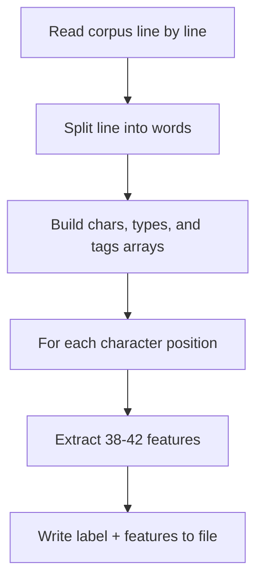

# 特徴量の抽出

コーパスの準備ができたら、次のステップはモデル学習用の特徴量を抽出することです。

## コマンド

```sh
litsea extract -l <LANGUAGE> <CORPUS_FILE> <FEATURES_FILE>
```

## 使用例

```sh
litsea extract -l japanese ./corpus.txt ./features.txt
```

出力:

```text
Feature extraction completed successfully.
```

## 内部処理の仕組み



1. `Extractor` がコーパスの各行を読み込む
2. 各文に対して、文字配列・文字種配列・タグ配列を持つ `Segmenter` コンテキストを作成する
3. 各文字位置（先頭を除く）について特徴量を抽出し、正しいラベルとともに書き込む

## 特徴量ファイルの形式

各行は1つの文字位置を表します:

```text
1	UP1:U UP2:U UP3:U BP1:UU BP2:UU UW1:B2 UW2:B1 UW3:は ...
-1	UP1:U UP2:U UP3:B BP1:UB BP2:BU UW1:B1 UW2:は UW3:テ ...
```

- 最初の列: ラベル（`1` = 境界、`-1` = 非境界）
- 残りの列: 特徴量（タブ区切り）

## ファイルサイズの目安

特徴量ファイルは、各文字位置が38-42個の特徴量文字列を生成するため、コーパスよりも大幅に大きくなります。1 MB のコーパスに対して、特徴量ファイルはおよそ 50-100 MB になることが見込まれます。
