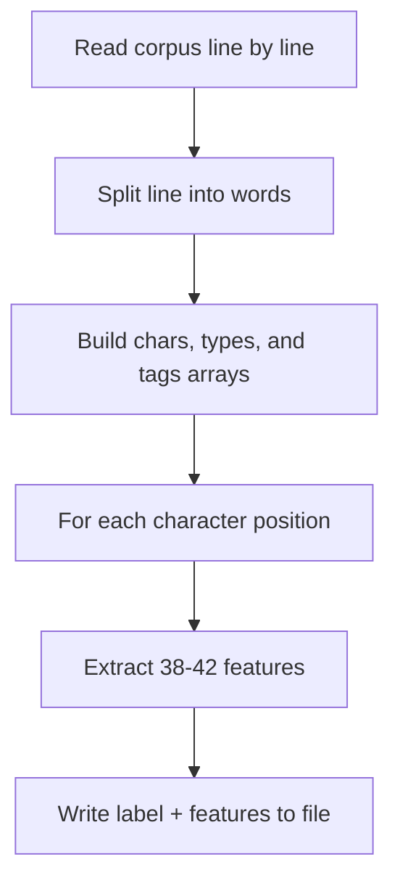

# 特徴量の抽出

コーパスの準備ができたら、次のステップはモデル学習用の特徴量を抽出することです。

## コマンド

```sh
litsea extract -l <LANGUAGE> <CORPUS_FILE> <FEATURES_FILE>
```

## 使用例

```sh
litsea extract -l japanese ./corpus.txt ./features.txt
```

出力:

```text
Feature extraction completed successfully.
```

## 内部処理の仕組み


```mermaid
flowchart TD
    A["Read corpus line by line"] --> B["Split line into words"]
    B --> C["Build chars, types, and tags arrays"]
    C --> D["For each character position"]
    D --> E["Extract 38-42 features"]
    E --> F["Write label + features to file"]
```

1. `Extractor` がコーパスの各行を読み込む
2. 各文に対して、文字配列・文字種配列・タグ配列を持つ `Segmenter` コンテキストを作成する
3. 各文字位置（先頭を除く）について特徴量を抽出し、正しいラベルとともに書き込む

## 特徴量ファイルの形式

各行は1つの文字位置を表します:

```text
1	UP1:U UP2:U UP3:U BP1:UU BP2:UU UW1:B2 UW2:B1 UW3:は ...
-1	UP1:U UP2:U UP3:B BP1:UB BP2:BU UW1:B1 UW2:は UW3:テ ...
```

- 最初の列: ラベル（`1` = 境界、`-1` = 非境界）
- 残りの列: 特徴量（タブ区切り）

## 品詞付き特徴量の抽出

品詞推定モデル用には、`--pos` フラグを使用して、二値境界ラベルの代わりに品詞ラベル付きの特徴量を抽出します。

### コマンド

```sh
litsea extract --pos -l <LANGUAGE> <CORPUS_FILE> <FEATURES_FILE>
```

### 使用例

```sh
litsea extract --pos -l japanese ./corpus.txt ./features.txt
```

### 品詞ラベル

品詞特徴量を抽出する場合、各文字位置には二値の `1`/`-1` ラベルではなく、18種類のセグメントラベルのいずれかが付与されます:

- **B-NOUN**, **B-VERB**, **B-ADJ**, **B-ADP**, **B-ADV**, **B-AUX**, **B-CCONJ**, **B-DET**, **B-INTJ**, **B-NUM**, **B-PART**, **B-PRON**, **B-PROPN**, **B-PUNCT**, **B-SCONJ**, **B-SYM**, **B-X** -- 対応する品詞タグを持つ単語境界
- **O** -- 非境界（単語の内部）

特徴量テンプレート（文字 n-gram、文字種 n-gram など）は標準の分割と同じで、ラベル体系のみが異なります。

### 品詞特徴量ファイルの形式

```text
B-NOUN	UP1:U UP2:U UP3:U BP1:UU BP2:UU UW1:B2 UW2:B1 UW3:は ...
O	UP1:U UP2:U UP3:B BP1:UB BP2:BU UW1:B1 UW2:は UW3:テ ...
B-VERB	UP1:U UP2:U UP3:U BP1:UU BP2:UU UW1:B2 UW2:B1 UW3:い ...
```

- 最初の列: セグメントラベル（例: `B-NOUN`、`O`）
- 残りの列: 特徴量（タブ区切り）

## ファイルサイズの目安

特徴量ファイルは、各文字位置が38-42個の特徴量文字列を生成するため、コーパスよりも大幅に大きくなります。1 MB のコーパスに対して、特徴量ファイルはおよそ 50-100 MB になることが見込まれます。
