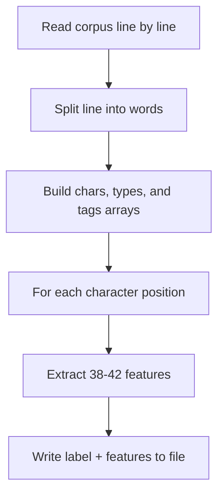

# 特徴量の抽出

コーパスの準備ができたら、次のステップはモデル学習用の特徴量を抽出することです。

## コマンド

```sh
litsea extract -l <LANGUAGE> <CORPUS_FILE> <FEATURES_FILE>
```

## 使用例

```sh
litsea extract -l japanese ./corpus.txt ./features.txt
```

出力:

```text
Feature extraction completed successfully.
```

## 内部処理の仕組み


```mermaid
flowchart TD
    A["Read corpus line by line"] --> B["Split line into words"]
    B --> C["Build chars, types, and tags arrays"]
    C --> D["For each character position"]
    D --> E["Extract 38-42 features"]
    E --> F["Write label + features to file"]
```

1. `Extractor` がコーパスの各行を読み込む
2. 各文に対して、文字配列・文字種配列・タグ配列を持つ `Segmenter` コンテキストを作成する
3. 各文字位置（先頭を除く）について特徴量を抽出し、正しいラベルとともに書き込む。`--pos` パイプラインでは先頭位置も出力され、最初の単語の品詞タグが学習データに含まれるようになっている

## 特徴量ファイルの形式

各行は1つの文字位置を表します。コーパス行 `これ は テスト です 。` に対する最初の2行は次のとおりです:

```text
-1	BC1:OI	BC2:II	BC3:II	BP1:UU	BP2:UU	BQ1:UOI	BQ2:UII	BQ3:UOI	BQ4:UII	...
1	BC1:II	BC2:II	BC3:IK	BP1:UU	BP2:UO	BQ1:UII	BQ2:UII	BQ3:OII	BQ4:OII	...
```

- 最初の列: ラベル（`1` = 境界、`-1` = 非境界）
- 残りの列: 特徴量。アルファベット順にソートされてタブ区切りで書き出される（そのため各行は `BC1:` 特徴量から始まる）

## 品詞付き特徴量の抽出

品詞推定モデル用には、`--pos` フラグを使用して、二値境界ラベルの代わりに品詞ラベル付きの特徴量を抽出します。

### コマンド

```sh
litsea extract --pos -l <LANGUAGE> <CORPUS_FILE> <FEATURES_FILE>
```

### 使用例

```sh
litsea extract --pos -l japanese ./corpus.txt ./features.txt
```

### 品詞ラベル

品詞特徴量を抽出する場合、各文字位置には二値の `1`/`-1` ラベルではなく、18種類のセグメントラベルのいずれかが付与されます:

- **B-NOUN**, **B-VERB**, **B-ADJ**, **B-ADP**, **B-ADV**, **B-AUX**, **B-CCONJ**, **B-DET**, **B-INTJ**, **B-NUM**, **B-PART**, **B-PRON**, **B-PROPN**, **B-PUNCT**, **B-SCONJ**, **B-SYM**, **B-X** -- 対応する品詞タグを持つ単語境界
- **O** -- 非境界（単語の内部）

特徴量テンプレート（文字 n-gram、文字種 n-gram など）は標準の分割と同じで、ラベル体系のみが異なります。

### 品詞特徴量ファイルの形式

品詞付きコーパス行 `これ/PRON は/PART テスト/NOUN です/AUX 。/PUNCT` に対する最初の3行は次のとおりです:

```text
B-PRON	BC1:OO	BC2:OI	BC3:II	BP1:UU	BP2:UU	BQ1:UOO	BQ2:UOI	BQ3:UOO	BQ4:UOI	...
O	BC1:OI	BC2:II	BC3:II	BP1:UU	BP2:UU	BQ1:UOI	BQ2:UII	BQ3:UOI	BQ4:UII	...
B-PART	BC1:II	BC2:II	BC3:IK	BP1:UU	BP2:UO	BQ1:UII	BQ2:UII	BQ3:OII	BQ4:OII	...
```

- 最初の列: セグメントラベル（例: `B-PRON`、`O`）
- 残りの列: 特徴量。アルファベット順にソートされてタブ区切りで書き出される（そのため各行は `BC1:` 特徴量から始まる）

## ファイルサイズの目安

特徴量ファイルは、各文字位置が38-42個の特徴量文字列を生成するため、コーパスよりも大幅に大きくなります。1 MB のコーパスに対して、特徴量ファイルはおよそ 50-100 MB になることが見込まれます。
