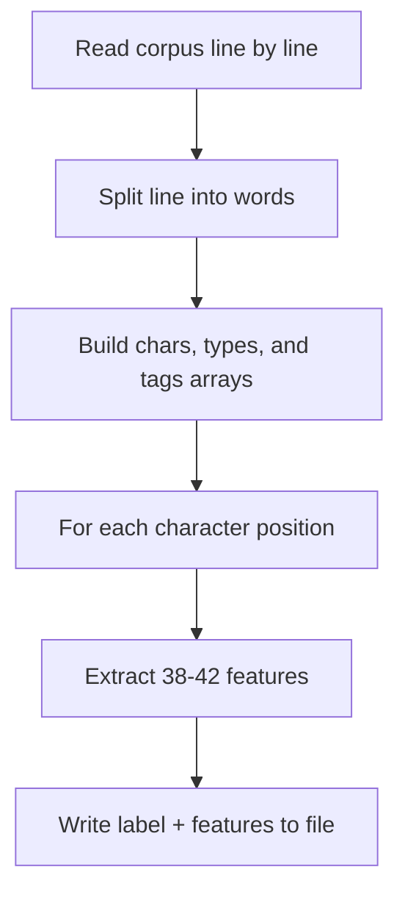

# 特徴量の抽出

コーパスの準備ができたら、次のステップはモデル学習用の特徴量を抽出することです。

## コマンド

```sh
litsea extract -l <LANGUAGE> <CORPUS_FILE> <FEATURES_FILE>
```

## 使用例

```sh
litsea extract -l japanese ./corpus.txt ./features.txt
```

出力:

```text
Feature extraction completed successfully.
```

## 内部処理の仕組み


```mermaid
flowchart TD
    A["Read corpus line by line"] --> B["Split line into words"]
    B --> C["Build chars, types, and tags arrays"]
    C --> D["For each character position"]
    D --> E["Extract 38-42 features"]
    E --> F["Write label + features to file"]
```

1. `Extractor` がコーパスの各行を読み込む
2. 各文に対して、文字配列・文字種配列・タグ配列を持つ `Segmenter` コンテキストを作成する
3. 各文字位置（先頭を除く）について特徴量を抽出し、正しいラベルとともに書き込む。`--pos` パイプラインでは先頭位置も出力され、最初の単語の品詞タグが学習データに含まれるようになっている

## 特徴量ファイルの形式

各行は1つの文字位置を表します。コーパス行 `これ は テスト です 。` に対する最初の2行は次のとおりです:

```text
-1	BC1:OI	BC2:II	BC3:II	BP1:UU	BP2:UU	BQ1:UOI	BQ2:UII	BQ3:UOI	BQ4:UII	...
1	BC1:II	BC2:II	BC3:IK	BP1:UU	BP2:UO	BQ1:UII	BQ2:UII	BQ3:OII	BQ4:OII	...
```

- 最初の列: ラベル（`1` = 境界、`-1` = 非境界）
- 残りの列: 特徴量。アルファベット順にソートされてタブ区切りで書き出される（そのため各行は `BC1:` 特徴量から始まる）

## 空白保持（TSV）コーパス形式

文の元の空白を保持したコーパス --- 韓国語モデルの学習に使用（単語間の空白が
韓国語における最も強力な境界シグナルであるため。詳細は
[韓国語](../language-support/korean.md#空白保持学習space-preserving-training)を参照）
--- から抽出するには、既定のスペース区切り形式の代わりに `--format tsv` を
指定します:

```sh
litsea extract --format tsv -l korean ./ko_corpus.tsv ./ko_features.txt
```

入力はタブ区切りのコーパス（1行1文、トークンをタブで区切る）で、トークンとして
空白文字そのもの（`" "`）を含められます。出力される特徴量ファイルの形式は既定の
`extract` と同一で、コーパスの解析方法のみが異なります。`--format tsv` は
`--pos` または `--two-stage` と併用できません。

## 品詞付き特徴量の抽出

品詞推定モデル用には、`--pos` フラグを使用して、二値境界ラベルの代わりに品詞ラベル付きの特徴量を抽出します。

### コマンド

```sh
litsea extract --pos -l <LANGUAGE> <CORPUS_FILE> <FEATURES_FILE>
```

### 使用例

```sh
litsea extract --pos -l japanese ./corpus.txt ./features.txt
```

### 品詞ラベル

品詞特徴量を抽出する場合、各文字位置には二値の `1`/`-1` ラベルではなく、18種類のセグメントラベルのいずれかが付与されます:

- **B-NOUN**, **B-VERB**, **B-ADJ**, **B-ADP**, **B-ADV**, **B-AUX**, **B-CCONJ**, **B-DET**, **B-INTJ**, **B-NUM**, **B-PART**, **B-PRON**, **B-PROPN**, **B-PUNCT**, **B-SCONJ**, **B-SYM**, **B-X** -- 対応する品詞タグを持つ単語境界
- **O** -- 非境界（単語の内部）

特徴量テンプレート（文字 n-gram、文字種 n-gram など）は標準の分割と同じで、ラベル体系のみが異なります。

### 品詞特徴量ファイルの形式

品詞付きコーパス行 `これ/PRON は/PART テスト/NOUN です/AUX 。/PUNCT` に対する最初の3行は次のとおりです:

```text
B-PRON	BC1:OO	BC2:OI	BC3:II	BP1:UU	BP2:UU	BQ1:UOO	BQ2:UOI	BQ3:UOO	BQ4:UOI	...
O	BC1:OI	BC2:II	BC3:II	BP1:UU	BP2:UU	BQ1:UOI	BQ2:UII	BQ3:UOI	BQ4:UII	...
B-PART	BC1:II	BC2:II	BC3:IK	BP1:UU	BP2:UO	BQ1:UII	BQ2:UII	BQ3:OII	BQ4:OII	...
```

- 最初の列: セグメントラベル（例: `B-PRON`、`O`）
- 残りの列: 特徴量。アルファベット順にソートされてタブ区切りで書き出される（そのため各行は `BC1:` 特徴量から始まる）

## 二段構成の特徴量抽出

[二段構成の品詞タグ付け](../algorithm/two-stage-tagging.md)（issue #147）用には、
`--pos` の代わりに `--two-stage` を使用します:

```sh
litsea extract --two-stage [--stage2-features full|balanced|fast] <CORPUS_FILE> <FEATURES_PREFIX>
```

### 使用例

```sh
litsea extract --two-stage -l japanese ./pos_corpus.txt ./two_stage_features
```

`--two-stage` は `--pos` と同じ POS タグ付きコーパス（`word/POS word/POS ...`）を
読み込みますが、コーパスを1パスで処理し、`<FEATURES_PREFIX>` から1ファイルではなく
**3ファイル**を書き出します:

| ファイル | 内容 |
|------|----------|
| `<FEATURES_PREFIX>.stage1` | 境界特徴量（ラベルは `B` または `O`）。`--pos` と同じテンプレート |
| `<FEATURES_PREFIX>.stage2` | 単語単位の特徴量（ラベルは UPOS タグ）。`--stage2-features` で選択したテンプレート |
| `<FEATURES_PREFIX>.lexicon` | 候補タグ語彙表（`surface\tTAG:count[,TAG:count...]`、出現頻度の高い順） |

`litsea train --two-stage` は同じプレフィックスから3ファイルすべてを読み込みます。
`--two-stage` は `--pos` または `--format tsv` と併用できません。

### `--stage2-features` の選び方

`--stage2-features` は `<FEATURES_PREFIX>.stage2` に書き出す stage-2 の単語単位
テンプレート（[単語単位の特徴量テンプレート（二段構成）](../algorithm/feature-extraction.md#単語単位の特徴量テンプレート二段構成)を参照）を選択し、
タグ付け品質とスループットをトレードオフします:

| 値 | テンプレート | トレードオフ |
|-------|-----------|-----------|
| `full` | 全23個の単語テンプレート | 最も高精度、最も低速 |
| `balanced` | `full` のサブセット | 中間的な構成 |
| `fast`（既定） | 最小のサブセット | 最速、それでいて競争力のある品質 |

この既定値の背後にある品質・スループットの実測比較については、
[stage-2 特徴量セットの選び方](../algorithm/two-stage-tagging.md#stage-2-特徴量セットの選び方)を参照してください。

```sh
litsea extract --two-stage --stage2-features balanced -l chinese ./pos_corpus.txt ./two_stage_features
```

## ファイルサイズの目安

特徴量ファイルは、各文字位置が38-42個の特徴量文字列を生成するため、コーパスよりも大幅に大きくなります。1 MB のコーパスに対して、特徴量ファイルはおよそ 50-100 MB になることが見込まれます。
