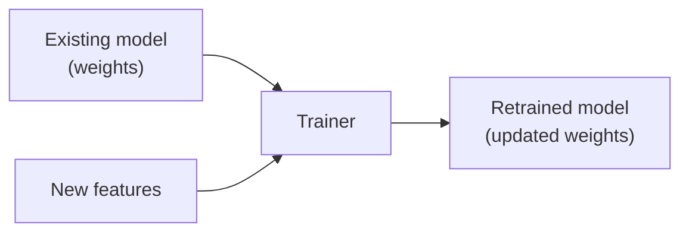

# モデルの再学習

既存のモデルに新しいデータで学習を再開することで、モデルを改善できます。

## コマンド

```sh
litsea train -t 0.005 -i 1000 -m <EXISTING_MODEL> <NEW_FEATURES_FILE> <OUTPUT_MODEL>
```

## 使用例

```sh
# 新しいコーパスから特徴量を抽出
litsea extract -l japanese ./new_corpus.txt ./new_features.txt

# 既存モデルから再学習
litsea train -t 0.005 -i 1000 \
    -m ./resources/japanese.model \
    ./new_features.txt \
    ./resources/japanese_v2.model
```

## 仕組み



1. Trainer が新しい特徴量ファイルから特徴量とインスタンスを初期化する
2. `-m` オプションで既存のモデルの重みを読み込む
3. 読み込まれた重みを出発点として学習を継続する
4. 新しいモデルは、学習済みのパターンをすべて引き継ぎつつ、新しいデータで改良される

## ユースケース

- **ドメイン適応** -- 汎用モデルをドメイン固有のテキスト（医療、法律など）でファインチューニングする
- **段階的な改善** -- ゼロから再学習せずに、より多くの学習データを追加する
- **エラー修正** -- 現在のモデルが誤りを犯す例を使って学習する

## 注意事項

- 出力モデルのパスは入力モデルと同じパスを指定できます（上書き）
- `-m` フラグはファイルパス、`file://`、`http://`、`https://` URI に対応しています
- 再学習は既存の重みから開始するため、必要な反復回数が少なくなる場合があります
