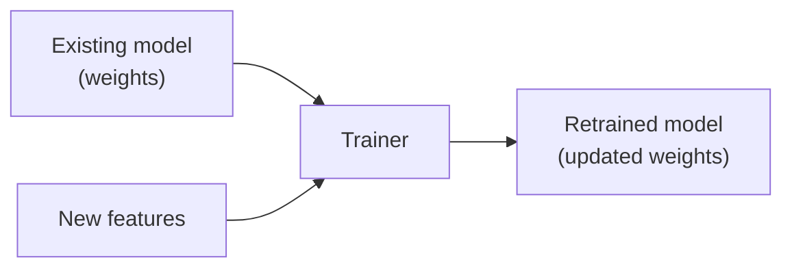

# モデルの再学習

既存のモデルに新しいデータで学習を再開することで、モデルを改善できます。

## コマンド

```sh
litsea train -t 0.0001 -i 20000 -m <EXISTING_MODEL> <NEW_FEATURES_FILE> <OUTPUT_MODEL>
```

## 使用例

```sh
# 新しいコーパスから特徴量を抽出
litsea extract -l japanese ./new_corpus.txt ./new_features.txt

# 既存モデルから再学習
litsea train -t 0.0001 -i 20000 \
    -m ./models/my_model.model \
    ./new_features.txt \
    ./models/my_model_v2.model
```

## 仕組み


```mermaid
flowchart LR
    A["Existing model<br/>(weights)"] --> C["Trainer"]
    B["New features"] --> C
    C --> D["Retrained model<br/>(updated weights)"]
```

1. Trainer が新しい特徴量ファイルから特徴量とインスタンスを初期化する
2. `-m` オプションで既存のモデルの重みを読み込む
3. 読み込まれた重みを出発点として学習を継続する
4. 新しいモデルは、学習済みのパターンをすべて引き継ぎつつ、新しいデータで改良される

## ユースケース

- **ドメイン適応** -- 汎用モデルをドメイン固有のテキスト（医療、法律など）でファインチューニングする
- **段階的な改善** -- ゼロから再学習せずに、より多くの学習データを追加する
- **エラー修正** -- 現在のモデルが誤りを犯す例を使って学習する

## 注意事項

- 出力モデルのパスは入力モデルと同じパスを指定できます（上書き）
- `-m` フラグはファイルパス、`file://`、`http://`、`https://` URI に対応しています
- 再学習は既存の重みから開始するため、必要な反復回数が少なくなる場合があります
- `-m` は通常の AdaBoost 学習でのみ利用できます。`train --two-stage` は
  `-m`/`--load-model-uri` に**対応していません** -- 二段構成モデルの増分学習は
  サポートされていないため、更新したい場合は `train --two-stage` で
  ゼロから再学習する必要があります
- 同梱の `japanese.model`、`chinese.model`、`korean.model` はこの `-m` を
  使うレシピでは作られていません -- これらは
  [学習手順](../pre-trained-models.md#学習手順)で説明している
  perceptron 畳み込み手順で学習されています。これらの上に `-m` で
  さらに増分 AdaBoost 学習を行うと、2 つの手法が混ざってしまいます。
  同梱モデルを更新したい場合は、その手順でゼロから再学習してください
