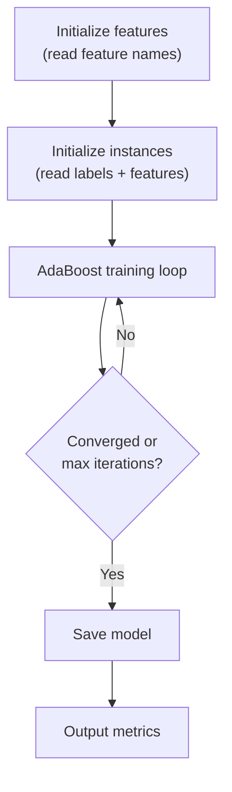

# モデルの学習

特徴量の抽出が完了したら、AdaBoost を使用してモデルを学習します。

## コマンド

```sh
litsea train [OPTIONS] <FEATURES_FILE> <MODEL_FILE>
```

## 基本的な使用例

```sh
litsea train -t 0.005 -i 1000 ./features.txt ./resources/japanese.model
```

## 学習プロセス



1. **特徴量の初期化** -- 特徴量ファイルを読み込み、特徴量インデックスを構築する
2. **インスタンスの初期化** -- 再度読み込み、ラベル付きインスタンスと初期重みをロードする
3. **学習ループ** -- 最適な特徴量を反復的に選択し、モデルの重みを更新し、インスタンスの重みを調整する
4. **モデルの保存** -- 非ゼロの特徴量の重みをモデルファイルに書き込む
5. **メトリクスの出力** -- 正解率、適合率、再現率、混同行列を表示する

## ハイパーパラメータ

| パラメータ | フラグ | デフォルト値 | ガイダンス |
|-----------|------|---------|----------|
| 閾値 | `-t` | 0.01 | 0.005 から開始することを推奨。値を低くすると反復回数が増えるが、学習時間も増加する |
| 反復回数 | `-i` | 100 | 1000 から開始することを推奨。学習停止時にまだ精度が向上している場合は増やす |

## 出力の解釈

```text
Result Metrics:
  Accuracy: 94.15% ( 564133 / 599198 )
  Precision: 95.57% ( 330454 / 345758 )
  Recall: 94.36% ( 330454 / 350215 )
  Confusion Matrix:
    True Positives: 330454
    False Positives: 15304
    False Negatives: 19761
    True Negatives: 233679
```

- **Accuracy（正解率）** -- 正しい予測の割合（境界と非境界の両方を含む）
- **Precision（適合率）** -- 境界と予測されたもののうち、実際に正しかった割合
- **Recall（再現率）** -- 実際の境界のうち、検出できた割合
- **True Positives（真陽性）** -- 正しく予測された境界
- **False Positives（偽陽性）** -- 境界がないのに境界と予測されたもの
- **False Negatives（偽陰性）** -- 見逃された実際の境界
- **True Negatives（真陰性）** -- 正しく予測された非境界

## 途中停止

学習中に **Ctrl+C を1回**押すと、現在の状態でモデルを保存して停止します。**Ctrl+C を2回**押すと、保存せずに即時終了します。
