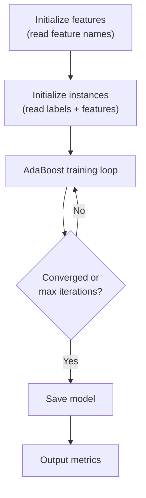

# モデルの学習

特徴量の抽出が完了したら、AdaBoost を使用してモデルを学習します。

## コマンド

```sh
litsea train [OPTIONS] <FEATURES_FILE> <MODEL_FILE>
```

## 基本的な使用例

```sh
litsea train -t 0.005 -i 1000 ./features.txt ./models/japanese.model
```

## 学習プロセス


```mermaid
flowchart TD
    A["Initialize features<br/>(read feature names)"] --> B["Initialize instances<br/>(read labels + features)"]
    B --> C["AdaBoost training loop"]
    C --> D{"Converged or<br/>max iterations?"}
    D -->|No| C
    D -->|Yes| E["Save model"]
    E --> F["Output metrics"]
```

1. **特徴量の初期化** -- 特徴量ファイルを読み込み、特徴量インデックスを構築する
2. **インスタンスの初期化** -- 再度読み込み、ラベル付きインスタンスと初期重みをロードする
3. **学習ループ** -- 最適な特徴量を反復的に選択し、モデルの重みを更新し、インスタンスの重みを調整する
4. **モデルの保存** -- 非ゼロの特徴量の重みをモデルファイルに書き込む
5. **メトリクスの出力** -- 正解率、適合率、再現率、混同行列を表示する

## ハイパーパラメータ

| パラメータ | フラグ | デフォルト値 | ガイダンス |
|-----------|------|---------|----------|
| 閾値 | `-t` | 0.01 | 0.005 から開始することを推奨。値を低くすると反復回数が増えるが、学習時間も増加する |
| 反復回数 | `-i` | 100 | 1000 から開始することを推奨。学習停止時にまだ精度が向上している場合は増やす |

## 出力の解釈

```text
Result Metrics:
  Accuracy: 94.15% ( 564133 / 599198 )
  Precision: 95.57% ( 330454 / 345758 )
  Recall: 94.36% ( 330454 / 350215 )
  Confusion Matrix:
    True Positives: 330454
    False Positives: 15304
    False Negatives: 19761
    True Negatives: 233679
```

- **Accuracy（正解率）** -- 正しい予測の割合（境界と非境界の両方を含む）
- **Precision（適合率）** -- 境界と予測されたもののうち、実際に正しかった割合
- **Recall（再現率）** -- 実際の境界のうち、検出できた割合
- **True Positives（真陽性）** -- 正しく予測された境界
- **False Positives（偽陽性）** -- 境界がないのに境界と予測されたもの
- **False Negatives（偽陰性）** -- 見逃された実際の境界
- **True Negatives（真陰性）** -- 正しく予測された非境界

## 途中停止

学習中に **Ctrl+C を1回**押すと、現在の状態でモデルを保存して停止します。**Ctrl+C を2回**押すと、保存せずに即時終了します。

## 品詞推定モデルの学習

品詞推定モデルを学習する場合は、`--pos` フラグを使用します。品詞モデルは AdaBoost（二値分類器）の代わりに **Averaged Perceptron**（多クラス分類器）アルゴリズムを使用します。

### 品詞学習コマンド

```sh
litsea train --pos --num-epochs 10 <FEATURES_FILE> <MODEL_FILE>
```

### 品詞学習の使用例

```sh
litsea train --pos --num-epochs 10 ./features.txt ./models/japanese_pos.model
```

### Averaged Perceptron と AdaBoost の比較

| 観点 | AdaBoost（分割） | Averaged Perceptron（品詞） |
|--------|------------------------|---------------------------|
| 分類 | 二値（境界 / 非境界） | 多クラス（18 セグメントラベル） |
| ラベル | `1`, `-1` | `B-NOUN`, `B-VERB`, ..., `O` |
| ハイパーパラメータ | 閾値、反復回数 | エポック数 |
| モデルサイズ | 約 1-22 KB | 約 11 MB |

### 品詞学習のハイパーパラメータ

| パラメータ | フラグ | デフォルト値 | ガイダンス |
|-----------|------|---------|----------|
| エポック数 | `--num-epochs` | 10 | 学習データ全体を何回繰り返すかを指定。10 から開始し、メトリクスに基づいて調整 |

### 品詞学習の出力

```text
Result Metrics:
  Accuracy: 98.34%
  Macro Precision: 97.87%
  Macro Recall: 91.67%
```

- **Accuracy（正解率）** -- 全クラスにわたる正しい予測の割合
- **Macro Precision（マクロ適合率）** -- 全品詞クラスの適合率の平均
- **Macro Recall（マクロ再現率）** -- 全品詞クラスの再現率の平均

### 品詞学習の途中停止

品詞学習中に **Ctrl+C を1回**押すと、現在の状態でモデルを保存して停止します。**Ctrl+C を2回**押すと、保存せずに即時終了します。
