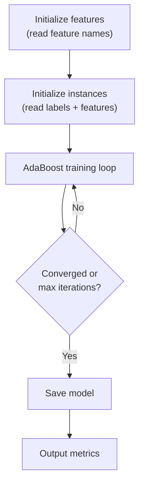

# モデルの学習

特徴量の抽出が完了したら、AdaBoost を使用してモデルを学習します。

## コマンド

```sh
litsea train [OPTIONS] <FEATURES_FILE> <MODEL_FILE>
```

## 基本的な使用例

```sh
litsea train -t 0.0001 -i 20000 ./features.txt ./models/japanese.model
```

## 学習プロセス


```mermaid
flowchart TD
    A["Initialize features<br/>(read feature names)"] --> B["Initialize instances<br/>(read labels + features)"]
    B --> C["AdaBoost training loop"]
    C --> D{"Converged or<br/>max iterations?"}
    D -->|No| C
    D -->|Yes| E["Save model"]
    E --> F["Output metrics"]
```

1. **特徴量の初期化** -- 特徴量ファイルを読み込み、特徴量インデックスを構築する
2. **インスタンスの初期化** -- 再度読み込み、ラベル付きインスタンスと初期重みをロードする
3. **学習ループ** -- 最適な特徴量を反復的に選択し、モデルの重みを更新し、インスタンスの重みを調整する
4. **モデルの保存** -- 非ゼロの特徴量の重みをモデルファイルに書き込む
5. **メトリクスの出力** -- 正解率、適合率、再現率、混同行列を表示する

## ハイパーパラメータ

| パラメータ | フラグ | デフォルト値 | ガイダンス |
|-----------|------|---------|----------|
| 閾値 | `-t` | 0.01 | 0.0001 から開始することを推奨（同梱モデルで使用）。値を低くすると早期停止が遅くなるが、学習時間も増加する |
| 反復回数 | `-i` | 100 | 20000 から開始することを推奨（同梱モデルで使用）。AdaBoost は 1 反復につき特徴を 1 つ選択するため、この値がモデルの特徴数の上限になる。デフォルト値では非常に小さいモデルになり、held-out 精度が大幅に低くなる |

## 出力の解釈

メトリクスは学習データに対して計算されます。反復回数が十分であれば、モデルは学習コーパスにほぼ完全に適合できてしまうため、現実的な品質を見積もるにはホールドアウトされたテキストで評価してください。

```text
Result Metrics:
  Accuracy: 100.00% ( 1075868 / 1075869 )
  Precision: 100.00% ( 161283 / 161284 )
  Recall: 100.00% ( 161283 / 161283 )
  Confusion Matrix:
    True Positives: 161283
    False Positives: 1
    False Negatives: 0
    True Negatives: 914585
```

- **Accuracy（正解率）** -- 正しい予測の割合（境界と非境界の両方を含む）
- **Precision（適合率）** -- 境界と予測されたもののうち、実際に正しかった割合
- **Recall（再現率）** -- 実際の境界のうち、検出できた割合
- **True Positives（真陽性）** -- 正しく予測された境界
- **False Positives（偽陽性）** -- 境界がないのに境界と予測されたもの
- **False Negatives（偽陰性）** -- 見逃された実際の境界
- **True Negatives（真陰性）** -- 正しく予測された非境界

## 途中停止

学習中に **Ctrl+C を1回**押すと、現在の状態でモデルを保存して停止します。**Ctrl+C を2回**押すと、保存せずに即時終了します。

## 品詞推定モデルの学習

品詞推定モデルを学習する場合は、`--pos` フラグを使用します。品詞モデルは AdaBoost（二値分類器）の代わりに **Averaged Perceptron**（多クラス分類器）アルゴリズムを使用します。

### 品詞学習コマンド

```sh
litsea train --pos --num-epochs 10 <FEATURES_FILE> <MODEL_FILE>
```

### 品詞学習の使用例

```sh
litsea train --pos --num-epochs 10 ./features.txt ./models/japanese_pos.model
```

### Averaged Perceptron と AdaBoost の比較

| 観点 | AdaBoost（分割） | Averaged Perceptron（品詞） |
|--------|------------------------|---------------------------|
| 分類 | 二値（境界 / 非境界） | 多クラス（18 セグメントラベル） |
| ラベル | `1`, `-1` | `B-NOUN`, `B-VERB`, ..., `O` |
| ハイパーパラメータ | 閾値、反復回数 | エポック数 |
| モデルサイズ | 約 18-22 KB | 約 9-19 MB |

### 品詞学習のハイパーパラメータ

| パラメータ | フラグ | デフォルト値 | ガイダンス |
|-----------|------|---------|----------|
| エポック数 | `--num-epochs` | 10 | 学習データ全体を何回繰り返すかを指定。10 から開始し、メトリクスに基づいて調整 |

### 品詞学習の出力

```text
Result Metrics (POS):
  Accuracy: 98.23% ( 277213 )
  Macro Precision: 96.82%
  Macro Recall: 93.30%
```

- **Accuracy（正解率）** -- 全クラスにわたる正しい予測の割合
- **Macro Precision（マクロ適合率）** -- 全品詞クラスの適合率の平均
- **Macro Recall（マクロ再現率）** -- 全品詞クラスの再現率の平均

### 品詞学習の途中停止

品詞学習中に **Ctrl+C を1回**押すと、現在の状態でモデルを保存して停止します。**Ctrl+C を2回**押すと、保存せずに即時終了します。

## 二段構成モデルの学習

より速い品詞推定には、`--pos` の代わりに `--two-stage` フラグを使用します。
[二段構成モデル](../algorithm/two-stage-tagging.md)（issue #147）を学習します:
二値の境界分類器（stage 1）と単語単位のタガー（stage 2）を、候補タグ語彙表と
ともに単一の `litsea-two-stage v1` ファイルに組み立てます。アーキテクチャ、
実測の品質・速度比較、新規用途で推奨する理由については
[二段構成 vs Joint タグ付け](../algorithm/two-stage-tagging.md)を参照してください。

### 二段構成学習コマンド

```sh
litsea extract --two-stage <CORPUS_FILE> <FEATURES_PREFIX>
litsea train --two-stage --num-epochs 50 <FEATURES_PREFIX> <MODEL_FILE>
```

`extract --two-stage` は `--pos` と同じ `word/POS` コーパスを読み込み、
`FEATURES_PREFIX` から 3 つのファイルを書き出します。`train --two-stage`
は同じプレフィックスからそれらを読み込みます。

### 二段構成学習の使用例

```sh
litsea extract --two-stage -l japanese ./pos_corpus.txt ./two_stage_features
litsea train --two-stage --num-epochs 50 ./two_stage_features ./models/japanese_two_stage.model
```

### 二段構成学習のハイパーパラメータ

| パラメータ | フラグ | デフォルト値 | ガイダンス |
|-----------|------|---------|----------|
| エポック数 | `--num-epochs` | 10 | 同梱モデル作成時のエポックスイープ（[二段構成 vs Joint タグ付け](../algorithm/two-stage-tagging.md#方法論についての注記-学習エポック数はアーキテクチャ以上に効く)を参照）で、分割品質が既定値を大きく超えて向上し続け **50** 付近でプラトーに達すると判明しました -- 同梱モデルは 10 ではなく 50 を使用しています |
| Dominance | `--dominance` | 0.99 | 分類器スキップの閾値、範囲は `(0.5, 1.0]`: 既知の単語のうち最頻タグが学習時の出現のこの割合以上を占めるものは、stage-2 分類器を呼ばずにタグ付けされます。値を小さくするとより頻繁に分類器をスキップします（高速だが語彙表への依存度が上がる）。既定値は同梱モデルと同じです |
| stage-2 特徴量セット | `extract --two-stage` の `--stage2-features` | `fast` | `full`、`balanced`、`fast`。[特徴量の抽出](extracting-features.md)と[特徴量セットの選び方](../algorithm/two-stage-tagging.md#stage-2-特徴量セットの選び方)を参照 |

### 二段構成学習の出力

```text
Result Metrics (Two-Stage):
  Stage 1 (boundary) Accuracy: 99.86% ( 277213 )
  Stage 1 Macro Precision: 99.85%
  Stage 1 Macro Recall: 99.86%
  Stage 2 (tagging) Accuracy: 99.09% ( 168333 )
  Stage 2 Macro Precision: 98.96%
  Stage 2 Macro Recall: 98.77%
```

AdaBoost・joint 品詞学習と同様、これらは in-sample のメトリクスです。
現実的な品質を見積もるには `litsea evaluate --pos` でホールドアウトされた
テキストを評価してください。`segment --pos` と `evaluate --pos` は
ファイルヘッダから二段構成モデルを自動判別するため、学習後の利用に
追加のフラグは不要です。

### 二段構成学習の途中停止

二段構成学習中に **Ctrl+C を1回**押すと、現在の状態でモデルを保存して停止します。**Ctrl+C を2回**押すと、保存せずに即時終了します。
