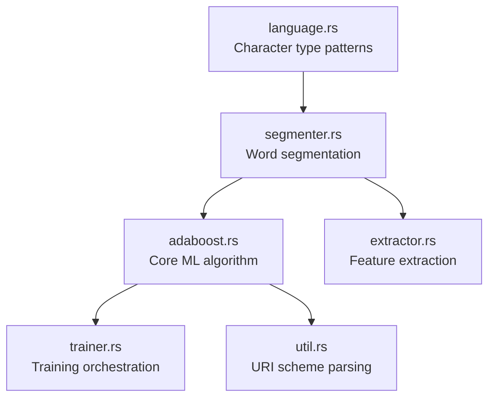

# Module Design

The `litsea` library crate is organized into six modules, each with a clear responsibility.

## Module Dependency Graph



## Module Details

### `language.rs` -- Language Definitions

Defines the `Language` enum and character type classification system.

- **`Language`** -- Enum with variants `Japanese`, `Chinese`, `Korean`
  - Implements `FromStr` (parses `"japanese"`, `"ja"`, `"chinese"`, `"zh"`, `"korean"`, `"ko"`)
  - Implements `Display` (outputs lowercase name)
  - Factory method `char_type_patterns()` returns language-specific patterns
- **`CharTypePatterns`** -- Maps characters to type codes (e.g., `"I"` for Hiragana, `"K"` for Katakana)
- **`CharMatcher`** -- Internal enum supporting both regex-based and closure-based character matching

### `segmenter.rs` -- Word Segmentation

The main user-facing module for text segmentation.

- **`Segmenter`** -- Holds a `Language`, `CharTypePatterns`, and `AdaBoost` instance
  - `new(language, learner)` -- Create a segmenter with an optional pre-trained model
  - `segment(sentence)` -- Segment text into words, returns `Vec<String>`
  - `get_type(ch)` -- Classify a single character into its type code
  - `get_attributes(i, tags, chars, types)` -- Extract feature set for a character position
  - `add_corpus(corpus)` -- Add training data from a space-separated corpus
  - `add_corpus_with_writer(corpus, callback)` -- Process corpus with a custom callback

### `adaboost.rs` -- AdaBoost Algorithm

The core machine learning engine for binary classification.

- **`AdaBoost`** -- The binary classifier
  - `new(threshold, num_iterations)` -- Create with training parameters
  - `initialize_features(path)` -- Load feature names from a training file
  - `initialize_instances(path)` -- Load labeled instances from a training file
  - `train(running)` -- Run the AdaBoost training loop
  - `predict(attributes)` -- Predict boundary (+1) or non-boundary (-1)
  - `load_model(uri)` -- Load model weights from file or URL (async)
  - `save_model(path)` -- Save model weights to a file
  - `get_metrics()` -- Calculate accuracy, precision, and recall
  - `get_bias()` -- Get the model's bias term
- **`Metrics`** -- Evaluation metrics (accuracy, precision, recall, confusion matrix)

### `extractor.rs` -- Feature Extraction

Extracts features from a corpus for model training.

- **`Extractor`** -- Wraps a `Segmenter` to process corpus files
  - `new(language)` -- Create an extractor for a specific language
  - `extract(corpus_path, features_path)` -- Read corpus, write feature file

### `trainer.rs` -- Training Orchestration

High-level training workflow that ties everything together.

- **`Trainer`** -- Orchestrates the full training pipeline
  - `new(threshold, num_iterations, features_path)` -- Initialize from a features file
  - `load_model(uri)` -- Optionally load an existing model for retraining (async)
  - `train(running, model_path)` -- Train and save the model, returns `Metrics`

### `util.rs` -- Utilities

URI scheme parsing for model loading.

- **`ModelScheme`** -- Enum with variants `Http`, `Https`, `File`
  - Used to determine how to load a model based on its URI prefix

## Public Exports

The library's `lib.rs` re-exports all modules and provides:

```rust
pub mod adaboost;
pub mod extractor;
pub mod language;
pub mod segmenter;
pub mod trainer;
pub mod util;

pub const VERSION: &str = env!("CARGO_PKG_VERSION");
pub fn version() -> &'static str { VERSION }
```
