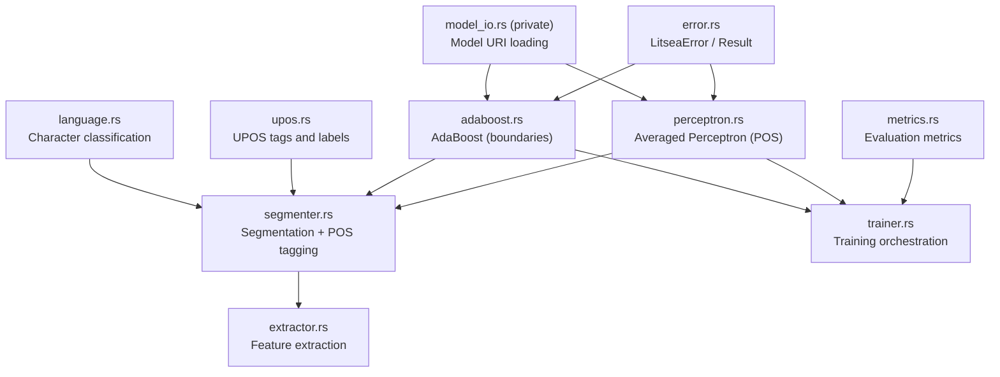

# Module Design

The `litsea` library crate is organized into focused modules, each with a clear responsibility.

## Module Dependency Graph


```mermaid
graph TD
    language["language.rs<br/>Character classification"]
    segmenter["segmenter.rs<br/>Segmentation + POS tagging"]
    adaboost["adaboost.rs<br/>AdaBoost (boundaries)"]
    perceptron["perceptron.rs<br/>Averaged Perceptron (POS)"]
    upos["upos.rs<br/>UPOS tags and labels"]
    extractor["extractor.rs<br/>Feature extraction"]
    trainer["trainer.rs<br/>Training orchestration"]
    model_io["model_io.rs (private)<br/>Model URI loading"]
    error["error.rs<br/>LitseaError / Result"]
    metrics["metrics.rs<br/>Evaluation metrics"]

    language --> segmenter
    upos --> segmenter
    adaboost --> segmenter
    perceptron --> segmenter
    segmenter --> extractor
    adaboost --> trainer
    perceptron --> trainer
    model_io --> adaboost
    model_io --> perceptron
    error --> adaboost
    error --> perceptron
    metrics --> trainer
```

## Module Details

### `language.rs` -- Language Definitions

Defines the `Language` enum and character type classification.

- **`Language`** -- Enum with variants `Japanese`, `Chinese`, `Korean`
  - Implements `FromStr` (parses `"japanese"`, `"ja"`, `"chinese"`, `"zh"`, `"korean"`, `"ko"`)
  - Implements `Display` (outputs lowercase name)
  - `char_type(c: char) -> &'static str` -- Classifies a character with a direct `match` on character ranges (allocation-free; no regex). Language-specific functions (`japanese_char_type`, etc.) share a `punct_latin_digit()` helper for the common `"P"`/`"A"`/`"N"` classes.

### `segmenter.rs` -- Word Segmentation and POS Tagging

The main user-facing module.

- **`Segmenter`** -- Holds a `Language`, an `AdaBoost` learner, and an optional `AveragedPerceptron` POS learner (fields are private; use `language()`, `learner()`, `learner_mut()`, `pos_learner()`, `pos_learner_mut()`)
  - `new(language, learner)` -- Create a segmenter with an optional pre-trained model
  - `with_pos_learner(language, pos_learner)` -- Create a segmenter for joint segmentation + POS tagging
  - `segment(sentence)` -- Segment text into words, returns `Vec<String>`
  - `segment_with_pos(sentence)` -- Segment and tag, returns `Vec<(String, Upos)>`
  - `char_type(ch)` -- Classify a single character into its type code
  - `add_corpus(corpus)` / `add_corpus_with_pos(corpus)` -- Add training data
  - `add_corpus_with_writer(corpus, callback)` / `add_corpus_with_pos_writer(corpus, callback)` -- Process a corpus with a custom callback

### `adaboost.rs` -- AdaBoost Algorithm

The binary classifier used for word boundary decisions.

- **`AdaBoost`**
  - `new(threshold, num_iterations)` -- Create with training parameters
  - `initialize_features(path)` / `initialize_instances(path)` -- Load training data
  - `train(running)` -- Run the AdaBoost training loop
  - `predict(&attributes)` -- Predict boundary (+1) or non-boundary (-1)
  - `load_model(uri)` (async) / `load_model_from_path(path)` / `load_model_from_reader(reader)` -- Load model weights
  - `save_model(path)` -- Save model weights to a file
  - `metrics()` -- Calculate accuracy, precision, and recall (`BinaryMetrics`)
  - `bias()` -- Get the model's bias term

### `perceptron.rs` -- Averaged Perceptron

The multiclass classifier used for joint segmentation + POS tagging.

- **`AveragedPerceptron`**
  - `add_instance(features, label)` -- Add a training instance
  - `train(num_epochs, running)` -- Train with weight averaging
  - `predict(&features)` -- Predict the best class label
  - `load_model(uri)` (async) / `load_model_from_path(path)` / `load_model_from_reader(reader)` -- Load model weights
  - `save_model(path)` -- Save model weights
  - `metrics()` -- Macro-averaged evaluation (`MulticlassMetrics`)
- Weights are stored in a feature → per-class vector layout for fast inference.

### `upos.rs` -- Universal POS Tags

- **`Upos`** -- The 17 Universal Dependencies POS tags (`NOUN`, `VERB`, ...)
- **`SegmentLabel`** -- Combined segmentation + POS label per character position (`B(Upos)` or `O`), with `Display`/`FromStr` for the `"B-NOUN"` / `"O"` string form

### `extractor.rs` -- Feature Extraction

Extracts features from a corpus for model training.

- **`Extractor`** -- Wraps a `Segmenter` to process corpus files
  - `new(language)` -- Create an extractor for a specific language
  - `extract(corpus_path, features_path)` -- Read a corpus, write a features file
  - `extract_with_pos(corpus_path, features_path)` -- Same for POS-tagged corpora

### `trainer.rs` -- Training Orchestration

High-level training workflows.

- **`Trainer`** -- Segmentation model training (AdaBoost)
  - `new(threshold, num_iterations, features_path)` -- Initialize from a features file
  - `load_model(uri)` -- Optionally load an existing model for incremental training (async)
  - `train(running, model_path)` -- Train and save, returns `BinaryMetrics`
- **`PosTrainer`** -- POS model training (Averaged Perceptron)
  - `new(num_epochs, features_path)` / `load_model(uri)` / `train(running, model_path)` returning `MulticlassMetrics`

### `error.rs` -- Error Handling

- **`LitseaError`** -- Error enum (`Io`, `InvalidData`, `InvalidInput`, `Unsupported`, and `Download` with the `remote_model` feature)
- **`Result<T>`** -- Alias used by every fallible API

### `metrics.rs` -- Evaluation Metrics

- **`BinaryMetrics`** -- Accuracy, precision, recall, confusion matrix (AdaBoost)
- **`MulticlassMetrics`** -- Accuracy and macro-averaged precision/recall (Averaged Perceptron)

### `model_io.rs` -- Model Loading I/O (private)

Internal module that resolves a model URI (plain path, `file://`, or `http(s)://` with the `remote_model` feature) and returns the raw model bytes. Not part of the public API.

## Public Exports

The library's `lib.rs` exposes the public modules and re-exports the main types:

```rust
pub mod adaboost;
pub mod error;
pub mod extractor;
pub mod language;
pub mod metrics;
mod model_io;
pub mod perceptron;
pub mod segmenter;
pub mod trainer;
pub mod upos;

pub use adaboost::AdaBoost;
pub use error::{LitseaError, Result};
pub use extractor::Extractor;
pub use language::Language;
pub use metrics::{BinaryMetrics, MulticlassMetrics};
pub use perceptron::AveragedPerceptron;
pub use segmenter::Segmenter;
pub use trainer::{PosTrainer, Trainer};
pub use upos::{SegmentLabel, Upos};

pub fn version() -> &'static str { ... }
```
