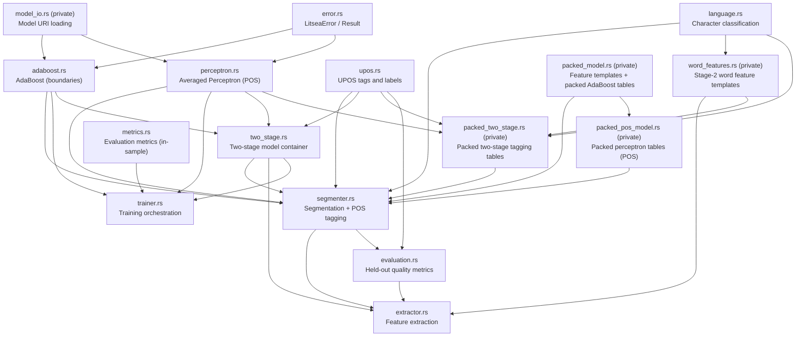

# Module Design

The `litsea` library crate is organized into focused modules, each with a clear responsibility.

## Module Dependency Graph


```mermaid
graph TD
    language["language.rs<br/>Character classification"]
    segmenter["segmenter.rs<br/>Segmentation + POS tagging"]
    adaboost["adaboost.rs<br/>AdaBoost (boundaries)"]
    perceptron["perceptron.rs<br/>Averaged Perceptron (POS)"]
    upos["upos.rs<br/>UPOS tags and labels"]
    extractor["extractor.rs<br/>Feature extraction"]
    trainer["trainer.rs<br/>Training orchestration"]
    two_stage["two_stage.rs<br/>Two-stage model container"]
    word_features["word_features.rs (private)<br/>Stage-2 word feature templates"]
    packed_model["packed_model.rs (private)<br/>Feature templates + packed AdaBoost tables"]
    packed_pos_model["packed_pos_model.rs (private)<br/>Packed perceptron tables (POS)"]
    packed_two_stage["packed_two_stage.rs (private)<br/>Packed two-stage tagging tables"]
    model_io["model_io.rs (private)<br/>Model URI loading"]
    error["error.rs<br/>LitseaError / Result"]
    metrics["metrics.rs<br/>Evaluation metrics (in-sample)"]
    evaluation["evaluation.rs<br/>Held-out quality metrics"]

    language --> segmenter
    upos --> segmenter
    adaboost --> segmenter
    perceptron --> segmenter
    packed_model --> segmenter
    packed_pos_model --> segmenter
    packed_two_stage --> segmenter
    two_stage --> segmenter
    packed_model --> packed_pos_model
    segmenter --> extractor
    two_stage --> extractor
    word_features --> extractor
    evaluation --> extractor
    adaboost --> trainer
    perceptron --> trainer
    two_stage --> trainer
    adaboost --> two_stage
    perceptron --> two_stage
    upos --> two_stage
    language --> word_features
    word_features --> packed_two_stage
    language --> packed_two_stage
    perceptron --> packed_two_stage
    upos --> packed_two_stage
    model_io --> adaboost
    model_io --> perceptron
    error --> adaboost
    error --> perceptron
    metrics --> trainer
    segmenter --> evaluation
    upos --> evaluation
```

## Module Details

### `language.rs` -- Language Definitions

Defines the `Language` enum and character type classification.

- **`Language`** -- Enum with variants `Japanese`, `Chinese`, `Korean`
  - Implements `FromStr` (parses `"japanese"`, `"ja"`, `"chinese"`, `"zh"`, `"korean"`, `"ko"`)
  - Implements `Display` (outputs lowercase name)
  - `char_type(c: char) -> &'static str` -- Classifies a character as a table lookup over the numeric type id returned by the private `char_type_id()`, which dispatches to a per-language function (`japanese_char_type_id`, etc.) implemented as a direct `match` on character ranges (allocation-free; no regex). The language-specific functions share a `punct_latin_digit()` helper for the common `"P"`/`"A"`/`"N"` classes.

### `segmenter.rs` -- Word Segmentation and POS Tagging

The main user-facing module.

- **`Segmenter`** -- Holds a `Language`, an `AdaBoost` learner, and an optional `AveragedPerceptron` POS learner (fields are private; use `language()`, `learner()`, `learner_mut()`, `pos_learner()`, `pos_learner_mut()`), plus internal caches for the compiled scoring tables (`packed`, `packed_pos`) that back `segment()` / `segment_with_pos()`, and an optional compiled two-stage tagging model (set by `with_two_stage_learner`; unlike the caches it is the stage-2 model itself -- the raw learner parts are dropped after compilation)
  - `new(language)` -- Create a segmenter with a default (empty) AdaBoost learner
  - `with_learner(language, learner)` -- Create a segmenter with a pre-configured AdaBoost learner (e.g. one that has loaded a pre-trained model)
  - `with_pos_learner(language, pos_learner)` -- Create a segmenter for joint segmentation + POS tagging
  - `with_two_stage_learner(language, learner)` -- Create a segmenter for two-stage segmentation + POS tagging from a `TwoStageLearner`
  - `segment(sentence)` -- Segment text into words, returns `Vec<String>`
  - `segment_with_pos(sentence)` -- Segment and tag, returns `Result<Vec<(String, Upos)>>` (`PosLearnerNotSet` unless a POS learner or a two-stage learner is set)
  - `char_type(ch)` -- Classify a single character into its type code
  - `add_corpus(corpus)` / `add_corpus_with_pos(corpus)` / `add_corpus_tsv(corpus)` -- Add training data (space-separated, POS-tagged, or tab-separated/space-preserving respectively; the latter is used for Korean, see issue #152)
  - `add_corpus_with_writer(corpus, callback)` / `add_corpus_with_pos_writer(corpus, callback)` / `add_corpus_tsv_with_writer(corpus, callback)` -- Process a corpus with a custom callback

### `adaboost.rs` -- AdaBoost Algorithm

The binary classifier used for word boundary decisions.

- **`AdaBoost`**
  - `new(threshold, num_iterations)` -- Create with training parameters
  - `initialize_features(path)` / `initialize_instances(path)` -- Load training data
  - `train(running)` -- Run the AdaBoost training loop
  - `predict(&attributes)` -- Predict boundary (+1) or non-boundary (-1)
  - `load_model(uri)` (async) / `load_model_from_path(path)` / `load_model_from_reader(reader)` -- Load model weights
  - `save_model(path)` -- Save model weights to a file
  - `metrics()` -- Calculate accuracy, precision, and recall (`BinaryMetrics`)
  - `bias()` -- Get the model's bias term

### `perceptron.rs` -- Averaged Perceptron

The multiclass classifier used for joint segmentation + POS tagging.

- **`AveragedPerceptron`**
  - `add_instance(features, label)` -- Add a training instance
  - `train(num_epochs, running)` -- Train with weight averaging (`running: &AtomicBool`)
  - `predict(&features)` -- Predict the best class label
  - `load_model(uri)` (async) / `load_model_from_path(path)` / `load_model_from_reader(reader)` -- Load model weights
  - `save_model(path)` -- Save model weights
  - `metrics()` -- Macro-averaged evaluation (`MulticlassMetrics`)
- Weights are stored in a feature → per-class vector layout for fast inference.

### `upos.rs` -- Universal POS Tags

- **`Upos`** -- The 17 Universal Dependencies POS tags (`NOUN`, `VERB`, ...)
- **`SegmentLabel`** -- Combined segmentation + POS label per character position (`B(Upos)` or `O`), with `Display`/`FromStr` for the `"B-NOUN"` / `"O"` string form

### `extractor.rs` -- Feature Extraction

Extracts features from a corpus for model training.

- **`Extractor`** -- Wraps a `Segmenter` to process corpus files
  - `new(language)` -- Create an extractor for a specific language
  - `extract(corpus_path, features_path)` -- Read a corpus, write a features file
  - `extract_tsv(corpus_path, features_path)` -- Same for tab-separated, space-preserving corpora (issue #152, used for Korean)
  - `extract_with_pos(corpus_path, features_path)` -- Same for POS-tagged corpora
  - `extract_two_stage(corpus_path, output_prefix, feature_set)` -- Extract two-stage training features (issue #147) from a POS-tagged corpus: writes `{output_prefix}.stage1` (boundary features), `.stage2` (word-level features), and `.lexicon`

### `trainer.rs` -- Training Orchestration

High-level training workflows.

- **`Trainer`** -- Segmentation model training (AdaBoost)
  - `new(threshold, num_iterations, features_path)` -- Initialize from a features file
  - `load_model(uri)` -- Optionally load an existing model for incremental training (async)
  - `train(running, model_path)` -- Train and save, returns `BinaryMetrics`
- **`PosTrainer`** -- POS model training (Averaged Perceptron)
  - `new(num_epochs, features_path)` / `load_model(uri)` / `train(running, model_path)` returning `MulticlassMetrics`
- **`TwoStageTrainer`** -- Two-stage model training (issue #147): trains a stage-1 boundary `AveragedPerceptron` and a stage-2 word tagger from the files `Extractor::extract_two_stage` writes, then collapses stage 1 to AdaBoost format and assembles a `TwoStageLearner`
  - `new(num_epochs, dominance, features_prefix)` / `train(running, model_path)` returning `TwoStageMetrics` (see [Trainer](../litsea/trainer.md) for the full API)
- **`TwoStageMetrics`** -- One `MulticlassMetrics` per stage of a `TwoStageTrainer::train` run (`stage1`, `stage2`)

### `two_stage.rs` -- Two-Stage Model Container

Defines the `litsea-two-stage v1` file format (see [Model File Format](../advanced/model-file-format.md)) and the types that hold a two-stage model in memory (issue #147).

- **`TwoStageLearner`** -- Bundles a stage-1 boundary `AdaBoost` model, a stage-2 `AveragedPerceptron` word tagger, and a candidate-tag lexicon; `new()` / `from_parts(...)` / `load_model_from_path(path)` / `save_model(path)` mirror the single-learner types' API
- **`TwoStageFeatureSet`** -- Enum selecting the stage-2 word-level template subset (`Fast`, `Balanced`, `Full`)
- **`AnyPosModel`** / **`ModelKind`** -- Auto-detect whether a model file is a joint (`AveragedPerceptron`) or two-stage model and dispatch accordingly; `AnyPosModel::load(uri)` (async) loads either kind, and `into_segmenter(language)` builds the matching `Segmenter` (via `with_pos_learner` or `with_two_stage_learner`)

### `error.rs` -- Error Handling

- **`LitseaError`** -- Error enum (`Io`, `InvalidData`, `InvalidInput`, `Unsupported`, `PosLearnerNotSet`, and `Download` with the `remote_model` feature). Marked `#[non_exhaustive]`, so downstream `match` expressions need a wildcard arm
- **`Result<T>`** -- Alias used by every fallible API

### `metrics.rs` -- Evaluation Metrics

- **`BinaryMetrics`** -- Accuracy, precision, recall, confusion matrix (AdaBoost)
- **`MulticlassMetrics`** -- Accuracy and macro-averaged precision/recall (Averaged Perceptron)

### `evaluation.rs` -- Held-Out Evaluation Metrics

While `metrics.rs` reports in-sample quality (measured on the training data itself, as printed by `train`), this module computes held-out quality: it compares a `Segmenter`'s output against a gold corpus using character-offset spans, so predicted and gold tokens can be matched exactly regardless of tokenization differences elsewhere in the sentence.

- **`SegmentationMetrics`** -- Word and boundary precision/recall/F1 for word segmentation, produced by `evaluate_segmentation(segmenter, gold)`
- **`PosMetrics`** -- Wraps a `SegmentationMetrics` plus tagged-word precision/recall/F1, produced by `evaluate_pos(segmenter, gold)` (fallible: propagates `segment_with_pos` errors)
- **`parse_gold_line(line, tsv)`** / **`parse_gold_pos_line(line)`** -- Parse a gold corpus line into tokens (plain or POS-tagged); also used by the two-stage extractor and trainer
- Backs the CLI's `litsea evaluate` subcommand

### `packed_model.rs` -- Feature Templates and Packed AdaBoost Tables (private)

Internal module holding the declarative feature-template table (`TEMPLATES`, the single source of truth for all feature consumers), the load-time parser that converts model feature strings into packed integer keys, and `PackedModel` -- the AdaBoost weights compiled into the merged/dense tables read by `segment()`'s two-pass scorer. Not part of the public API.

### `packed_pos_model.rs` -- Packed Perceptron Tables (private)

Internal multiclass twin of `PackedModel` (issue #143): compiles the Averaged Perceptron's per-class weight rows into the same two-pass table structure (sparse `(class, weight)` rows for the char-bearing families, dense rows plus a presence bitset for the tag/type-only templates, pre-parsed `SegmentLabel`s) read by `segment_with_pos()`. Not part of the public API.

### `packed_two_stage.rs` -- Packed Two-Stage Tagging Tables (private)

Internal module that compiles a `TwoStageLearner`'s stage-2 tagger and lexicon into the dense/sparse scoring tables `segment_with_pos()`'s two-stage path reads, mirroring what `packed_model.rs` / `packed_pos_model.rs` do for the AdaBoost and joint-perceptron learners: a surface map covering the lexicon and dominance-skip tags, sparse per-class rows for the char-valued word-feature templates (from `word_features.rs`), and dense tables for the type-valued and word-length templates. Not part of the public API.

### `word_features.rs` -- Stage-2 Word Feature Templates (private)

Internal module defining the word-level feature templates used by the two-stage tagger's stage 2 (surface, word length, first/last char and type, context chars/types/bigrams, ...). It is the single source of truth for the template set: the training extractor (via `extract_two_stage`) writes feature strings with `write_word_features`, and `packed_two_stage.rs` compiles the same strings back into integer keys with `parse_word_feature`, pinned against each other by a round-trip test. Not part of the public API.

### `model_io.rs` -- Model Loading I/O (private)

Internal module that resolves a model URI (plain path, `file://`, or `http(s)://` with the `remote_model` feature) and returns the raw model bytes. Not part of the public API.

## Public Exports

The library's `lib.rs` exposes the public modules and re-exports the main types:

```rust
pub mod adaboost;
pub mod error;
pub mod evaluation;
pub mod extractor;
pub mod language;
pub mod metrics;
mod model_io;
mod packed_model;
mod packed_pos_model;
mod packed_two_stage;
pub mod perceptron;
pub mod segmenter;
pub mod trainer;
pub mod two_stage;
pub mod upos;
mod word_features;

pub use adaboost::AdaBoost;
pub use error::{LitseaError, Result};
pub use evaluation::{PosMetrics, SegmentationMetrics};
pub use extractor::Extractor;
pub use language::{Language, ParseLanguageError};
pub use metrics::{BinaryMetrics, MulticlassMetrics};
pub use perceptron::AveragedPerceptron;
pub use segmenter::Segmenter;
pub use trainer::{PosTrainer, Trainer, TwoStageMetrics, TwoStageTrainer};
pub use two_stage::{
    AnyPosModel, ModelKind, ParseTwoStageFeatureSetError, TwoStageFeatureSet, TwoStageLearner,
};
pub use upos::{ParseSegmentLabelError, ParseUposError, SegmentLabel, Upos};

pub fn version() -> &'static str { ... }
```
