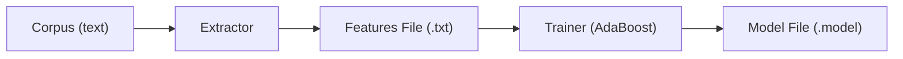
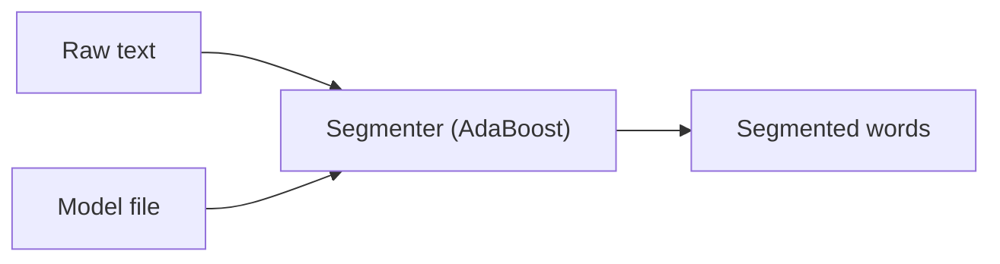

# Architecture Overview

Litsea is designed as a compact, dictionary-free word segmentation system. It treats word segmentation as a **binary classification problem** and uses **AdaBoost** to learn word boundary patterns from character-level features.

## High-Level Data Flow

Litsea has two main workflows: **training** and **segmentation**.

### Training Pipeline

1. **Corpus preparation** -- Prepare text with words separated by spaces
2. **Feature extraction** -- The `Extractor` reads the corpus, classifies characters by type, and outputs labeled feature vectors
3. **Model training** -- The `Trainer` feeds features into AdaBoost, which iteratively selects the most informative features and produces a compact model

### Segmentation Pipeline

1. **Model loading** -- Load a pre-trained model (from file or URL)
2. **Character classification** -- For each character in the input, determine its type code based on language-specific patterns
3. **Feature extraction** -- Build a feature set for each character position using a sliding window
4. **Prediction** -- AdaBoost predicts whether each position is a word boundary

## Design Principles

- **No dictionary dependency** -- Unlike MeCab or Lindera, Litsea relies solely on a statistical model learned from character patterns
- **Compact models** -- Model files are typically 1-22 KB, containing only the feature weights that matter
- **Language-agnostic framework** -- The core algorithm is the same for all languages; only the character type patterns differ
- **Simple extensibility** -- Adding a new language requires only defining character type patterns and training a model
