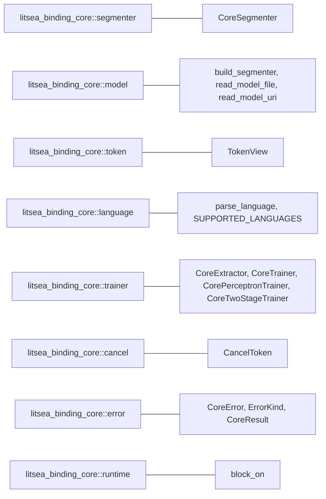

# litsea-binding-core

`litsea-binding-core` holds the FFI-independent logic shared by every Litsea language binding. It depends only on `litsea` (plus Tokio on native targets, for the blocking wrappers) and never on PyO3, napi, ext-php-rs, magnus, or wasm-bindgen, so it can be unit-tested without any host-language toolchain.

## Installation

```toml
[dependencies]
litsea-binding-core = "0.12.0"
```

## Module Map



| Module | Primary Types | Purpose |
|--------|--------------|---------|
| `segmenter` | `CoreSegmenter` | Segmentation and POS tagging, single and batch, with a reusable buffer |
| `model` | `BuiltSegmenter`, `build_segmenter` | Model loading and model-kind detection |
| `token` | `TokenView` | Token with surface, byte offsets, and optional UPOS tag |
| `language` | `SUPPORTED_LANGUAGES`, `parse_language` | Language-name parsing and enumeration |
| `trainer` | `CoreExtractor`, `CoreTrainer`, `CorePerceptronTrainer`, `CoreTwoStageTrainer` | Feature extraction and training (native targets only) |
| `cancel` | `CancelToken` | Cooperative cancellation of training |
| `error` | `CoreError`, `ErrorKind`, `CoreResult` | Error categories the bindings map to exceptions |
| `runtime` | `block_on` | Runs the async model loader from synchronous hosts (native targets only) |

## Segmentation

```rust
use litsea::Language;
use litsea_binding_core::CoreSegmenter;

let segmenter = CoreSegmenter::from_path(Language::Japanese, "models/japanese.model".as_ref())?;

assert_eq!(
    segmenter.segment("これはテストです。"),
    vec!["これ", "は", "テスト", "です", "。"]
);
```

For space-delimited languages the whitespace is returned as its own token, so the tokens still reconstruct the input exactly — `korean.model` splits `"안녕하세요 반갑습니다"` into `["안녕하세요", " ", "반갑습니다"]`.

`CoreSegmenter` holds an `Arc<Segmenter>` plus a `Mutex<SegmentBuffer>`. `Segmenter` is `Send + Sync` and a segmenter built from a loaded model has its packed tables already compiled, so concurrent `segment` calls take only an internal read lock; the mutex protects the scratch buffer alone. One instance can therefore be shared across threads and reused indefinitely, which is what the bindings do.

| Method | Returns |
|--------|---------|
| `segment(text)` | `Vec<String>` |
| `segment_batch(texts)` | `Vec<Vec<String>>`, reusing one buffer |
| `segment_tokens(text)` | `Vec<TokenView>` with byte offsets, `pos` unset |
| `segment_with_pos(text)` | `CoreResult<Vec<TokenView>>` with byte offsets and UPOS tags |
| `segment_with_pos_batch(texts)` | `CoreResult<Vec<Vec<TokenView>>>` |

Byte offsets are exact: tokens tile the input without gaps or overlaps, so `&text[token.byte_start..token.byte_end] == token.surface` holds for every token, including for space-preserving languages such as Korean and English.

Note that `segment_with_pos_batch` cannot amortize allocations the way `segment_batch` does — `litsea` has no buffer-reusing variant of `segment_with_pos`.

## Model loading

| Constructor | Availability |
|-------------|--------------|
| `CoreSegmenter::from_bytes(language, bytes)` | Everywhere, including wasm32 |
| `CoreSegmenter::from_path(language, path)` | Native targets |
| `CoreSegmenter::from_uri(language, uri).await` | Everywhere (`http(s)://` needs the `remote_model` feature) |
| `CoreSegmenter::from_uri_blocking(language, uri)` | Native targets |

All of them go through `build_segmenter`, which decides what to build from the model file itself:

| Detected kind | Result |
|---------------|--------|
| Two-stage model (`litsea-two-stage v1`) | POS-capable segmenter, `has_pos() == true` |
| AdaBoost-format model | Segmentation-only segmenter, `has_pos() == false` |
| Joint POS model (legacy) | `ErrorKind::Model` error explaining that joint models were removed |

Because the bytes are read once and then dispatched, a remote model is downloaded a single time.

## Errors

`CoreError` carries an `ErrorKind` plus a message. The kinds are stable strings intended to be surfaced to the host language.

| Kind | `as_str()` | Raised when |
|------|-----------|-------------|
| `InvalidArgument` | `invalid_argument` | Unknown language name, unknown feature set, unusable trainer |
| `Model` | `model` | Failed download, or a model of the wrong kind |
| `Io` | `io` | A file could not be read or written |
| `Parse` | `parse` | Malformed model or training data |
| `Unsupported` | `unsupported` | The scheme or operation is unavailable in this build |
| `PosUnavailable` | `pos_unavailable` | POS tagging requested from a segmentation-only model |
| `Runtime` | `runtime` | Anything else |

The set does not change when the `remote_model` feature is toggled, so a binding's exception hierarchy stays fixed.

## Training

Available on native targets only; feature extraction and training are file-based.

```rust
use litsea::Language;
use litsea_binding_core::{CancelToken, CoreExtractor, CoreTrainer, CorpusFormat};

CoreExtractor::new(Language::Japanese).extract(
    "corpus.txt".as_ref(),
    "features.txt".as_ref(),
    CorpusFormat::PlainText,
    false, // tag_free
)?;

let metrics = CoreTrainer::new(0.01, 10_000, "features.txt".as_ref())?
    .train(&CancelToken::new(), "japanese.model".as_ref())?;
println!("accuracy: {:.2}%", metrics.accuracy);
```

`CoreTwoStageTrainer` mirrors the CLI's `train --pos` flow. It can only be used once, because `litsea`'s `TwoStageTrainer::train` consumes the trainer (stage 1 is collapsed into an AdaBoost model and cannot be retrained in place); a second call returns an `InvalidArgument` error, and `is_available()` reports the state.

### Cancellation semantics

Cancelling is cooperative and is **not** an error:

- the trainer stops at its next check point,
- the partially trained model is still written to the destination path,
- and its metrics are returned normally.

Checks happen once per boosting iteration for AdaBoost training, and once per epoch and per instance for perceptron training, so perceptron training reacts far faster. `CancelToken` clones share one flag, so a token handed to a background thread can stop training that another thread is driving.

## Platform support

On `wasm32-unknown-unknown`, `trainer`, `runtime`, `read_model_file`, and `CoreSegmenter::from_path` are compiled out — wasm32 has no filesystem and no blocking runtime. WASM callers fetch the model bytes in JavaScript and use `CoreSegmenter::from_bytes`.

## Features

| Feature | Default | Effect |
|---------|---------|--------|
| `remote_model` | off | Enables `litsea/remote_model`, so `http(s)://` model URIs resolve |
