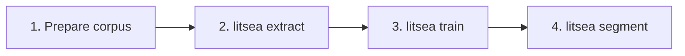

# CLI Reference Overview

The `litsea` CLI provides commands for word segmentation, model training, and text processing.

## Usage

```sh
litsea <COMMAND> [OPTIONS] [ARGS]
```

## Commands

| Command | Description |
|---------|------------|
| [`extract`](extract.md) | Extract features from a corpus for training |
| [`train`](train.md) | Train a word segmentation model |
| [`segment`](segment.md) | Segment text into words using a trained model |
| [`split-sentences`](split-sentences.md) | Split text into sentences using Unicode UAX #29 |

## Global Options

| Option | Description |
|--------|------------|
| `-h`, `--help` | Show help information |
| `-V`, `--version` | Show version number |

## Typical Workflow



1. Prepare a corpus with words separated by spaces
2. Extract features: `litsea extract -l japanese corpus.txt features.txt`
3. Train a model: `litsea train -t 0.005 -i 1000 features.txt model.model`
4. Segment text: `echo "text" | litsea segment -l japanese model.model`
