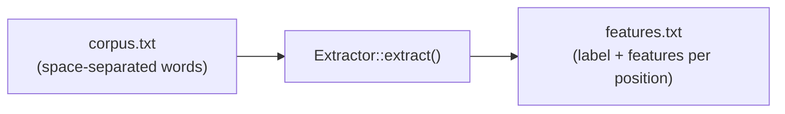

# Extractor

The `Extractor` struct extracts features from a corpus file for model training.

## Definition

```rust
pub struct Extractor {
    segmenter: Segmenter,
}
```

## Constructor

### `Extractor::new`

```rust
pub fn new(language: Language) -> Self
```

Creates a new extractor for the specified language. Internally creates a `Segmenter` without a pre-trained model.

```rust
use litsea::extractor::Extractor;
use litsea::language::Language;

let mut extractor = Extractor::new(Language::Japanese);
```

## Methods

### `extract`

```rust
pub fn extract(
    &mut self,
    corpus_path: &Path,
    features_path: &Path,
) -> Result<(), Box<dyn Error>>
```

Reads a corpus file (space-separated words, one sentence per line) and writes the extracted features to the output file.

```rust
use std::path::Path;

extractor.extract(
    Path::new("./corpus.txt"),
    Path::new("./features.txt"),
)?;
```

### Pipeline



The extractor:
1. Reads each line from the corpus file
2. Calls `Segmenter::add_corpus_with_writer()` to process each line
3. Writes the label and feature set for each character position to the output file
