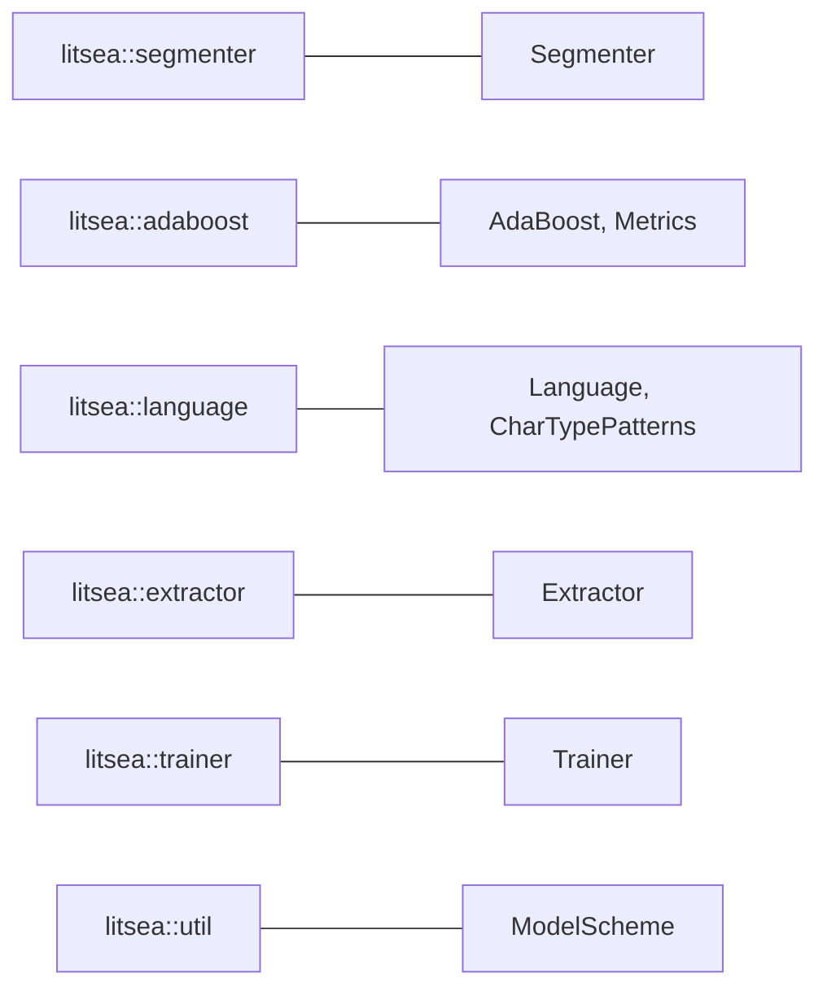

# Library API Overview

The `litsea` crate provides a Rust API for word segmentation, model training, and feature extraction.

## Installation

```toml
[dependencies]
litsea = "0.4.0"
tokio = { version = "1", features = ["rt-multi-thread", "macros"] }
```

## Module Map



| Module | Primary Types | Purpose |
|--------|--------------|---------|
| `litsea::segmenter` | `Segmenter` | Word segmentation |
| `litsea::adaboost` | `AdaBoost`, `Metrics` | Binary classification, model I/O |
| `litsea::language` | `Language`, `CharTypePatterns` | Language definitions, character classification |
| `litsea::extractor` | `Extractor` | Feature extraction from corpus |
| `litsea::trainer` | `Trainer` | Training orchestration |
| `litsea::util` | `ModelScheme` | URI scheme parsing |

## Quick Example

```rust
use litsea::adaboost::AdaBoost;
use litsea::language::Language;
use litsea::segmenter::Segmenter;

#[tokio::main]
async fn main() -> Result<(), Box<dyn std::error::Error>> {
    let mut learner = AdaBoost::new(0.01, 100);
    learner.load_model("./resources/japanese.model").await?;

    let segmenter = Segmenter::new(Language::Japanese, Some(learner));
    let tokens = segmenter.segment("これはテストです。");

    assert_eq!(tokens, vec!["これ", "は", "テスト", "です", "。"]);
    Ok(())
}
```

## API Documentation

Full API documentation is available on [docs.rs/litsea](https://docs.rs/litsea).
