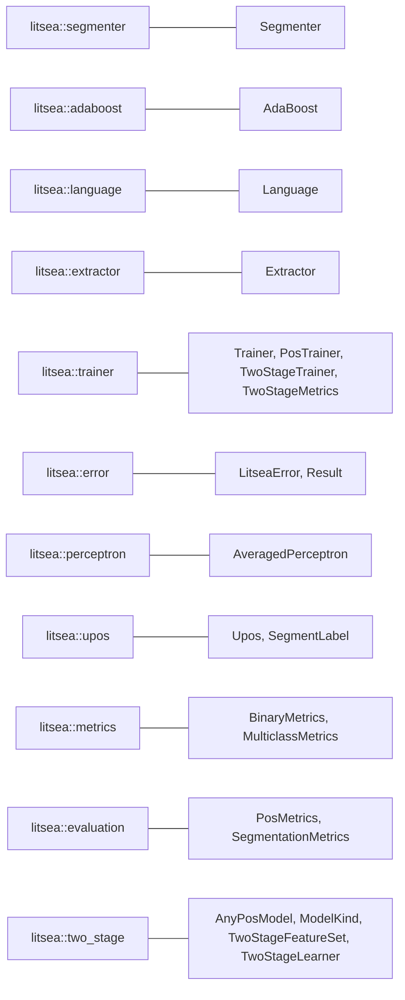

# Library API Overview

The `litsea` crate provides a Rust API for word segmentation, model training, and feature extraction.

## Installation

```toml
[dependencies]
litsea = "0.11.0"
```

Loading models from local files is synchronous and needs no async runtime. An async runtime such as `tokio` is only required when loading models over HTTP/HTTPS with the async `load_model` method (this includes `AnyPosModel::load`, which always resolves the model URI through the same async path).

## Module Map


```mermaid
graph LR
    A["litsea::segmenter"] --- B["Segmenter"]
    C["litsea::adaboost"] --- D["AdaBoost"]
    E["litsea::language"] --- F["Language"]
    G["litsea::extractor"] --- H["Extractor"]
    I["litsea::trainer"] --- J["Trainer, PosTrainer, TwoStageTrainer, TwoStageMetrics"]
    K["litsea::error"] --- L["LitseaError, Result"]
    M["litsea::perceptron"] --- N["AveragedPerceptron"]
    O["litsea::upos"] --- P["Upos, SegmentLabel"]
    Q["litsea::metrics"] --- R["BinaryMetrics, MulticlassMetrics"]
    S["litsea::evaluation"] --- T["PosMetrics, SegmentationMetrics"]
    U["litsea::two_stage"] --- V["AnyPosModel, ModelKind, TwoStageFeatureSet, TwoStageLearner"]
```

| Module | Primary Types | Purpose |
|--------|--------------|---------|
| `litsea::segmenter` | `Segmenter` | Word segmentation, joint segmentation with POS tagging |
| `litsea::adaboost` | `AdaBoost` | Binary classification, model I/O |
| `litsea::perceptron` | `AveragedPerceptron` | Multiclass classification (POS tagging), model I/O |
| `litsea::upos` | `Upos`, `SegmentLabel` | UPOS POS tags, segment labels |
| `litsea::language` | `Language` | Language definitions, character classification |
| `litsea::extractor` | `Extractor` | Feature extraction from corpus |
| `litsea::trainer` | `Trainer`, `PosTrainer`, `TwoStageTrainer`, `TwoStageMetrics` | Training orchestration |
| `litsea::error` | `LitseaError`, `Result` | Error type and result alias |
| `litsea::metrics` | `BinaryMetrics`, `MulticlassMetrics` | Evaluation metrics (in-sample) |
| `litsea::evaluation` | `PosMetrics`, `SegmentationMetrics` | Held-out evaluation against a gold corpus |
| `litsea::two_stage` | `AnyPosModel`, `ModelKind`, `TwoStageFeatureSet`, `TwoStageLearner` | Two-stage model container and auto-detecting loader |

All primary types are also re-exported at the crate root, so `use litsea::Segmenter;` works as a shorthand for `use litsea::segmenter::Segmenter;`.

## Quick Example

```rust
use std::path::Path;

use litsea::adaboost::AdaBoost;
use litsea::language::Language;
use litsea::segmenter::Segmenter;

fn main() -> litsea::Result<()> {
    let mut learner = AdaBoost::new(0.01, 100);
    learner.load_model_from_path(Path::new("./models/RWCP.model"))?;

    let segmenter = Segmenter::with_learner(Language::Japanese, learner);
    let tokens = segmenter.segment("これはテストです。");

    assert_eq!(tokens, vec!["これ", "は", "テスト", "です", "。"]);
    Ok(())
}
```

## Quick Example (POS Tagging)

```rust
use std::path::Path;

use litsea::language::Language;
use litsea::perceptron::AveragedPerceptron;
use litsea::segmenter::Segmenter;

fn main() -> litsea::Result<()> {
    let mut pos_learner = AveragedPerceptron::new();
    pos_learner.load_model_from_path(Path::new("./models/japanese_pos.model"))?;

    let segmenter = Segmenter::with_pos_learner(Language::Japanese, pos_learner);
    let tokens = segmenter.segment_with_pos("これはテストです。")?;

    for (word, pos) in &tokens {
        print!("{}/{} ", word, pos);
    }
    println!();

    Ok(())
}
```

## Quick Example (Any POS Model)

The CLI's `segment --pos` uses this pattern so it works with either a joint or a two-stage model file without the caller needing to know which:

```rust
use litsea::language::Language;
use litsea::two_stage::AnyPosModel;

#[tokio::main]
async fn main() -> litsea::Result<()> {
    // Works for both joint (`*_pos.model`) and two-stage
    // (`*_two_stage.model`) model files -- the kind is auto-detected.
    let model = AnyPosModel::load("./models/japanese_two_stage.model").await?;
    let segmenter = model.into_segmenter(Language::Japanese);

    let tokens = segmenter.segment_with_pos("これはテストです。")?;
    for (word, pos) in &tokens {
        print!("{}/{} ", word, pos);
    }
    println!();

    Ok(())
}
```

## API Documentation

Full API documentation is available on [docs.rs/litsea](https://docs.rs/litsea).
