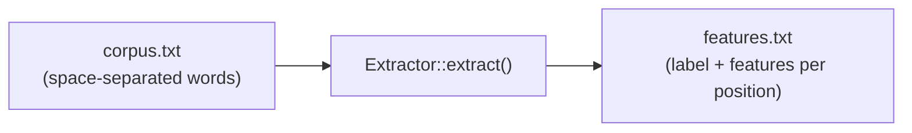

# Extractor

The `Extractor` struct extracts features from a corpus file for model training.

## Definition

```rust
pub struct Extractor {
    segmenter: Segmenter,
}
```

## Constructor

### `Extractor::new`

```rust
pub fn new(language: Language) -> Self
```

Creates a new extractor for the specified language. Internally creates a `Segmenter` without a pre-trained model. `Extractor` also implements `Default`, which is equivalent to `Extractor::new(Language::Japanese)`.

```rust
use litsea::extractor::Extractor;
use litsea::language::Language;

let extractor = Extractor::new(Language::Japanese);
```

The extraction methods take `&self`, so the binding does not need to be mutable.

## Methods

### `extract`

```rust
pub fn extract(
    &self,
    corpus_path: &Path,
    features_path: &Path,
) -> litsea::Result<()>
```

Reads a corpus file (space-separated words, one sentence per line) and writes the extracted features to the output file.

```rust
use std::path::Path;

extractor.extract(
    Path::new("./corpus.txt"),
    Path::new("./features.txt"),
)?;
```

### Pipeline



The extractor:

1. Reads each line from the corpus file
2. Calls `Segmenter::add_corpus_with_writer()` to process each line
3. Writes the label and feature set for each character position to the output file

### `extract_tsv`

```rust
pub fn extract_tsv(
    &self,
    corpus_path: &Path,
    features_path: &Path,
) -> litsea::Result<()>
```

Reads a tab-separated corpus file (tokens separated by tabs, one sentence
per line; a token may be a literal space `" "`) and writes the extracted
features. The preserved spaces let the model learn from space characters as
boundary context — used to train the Korean model (issue #152). Output
format is identical to `extract`.

```rust
use std::path::Path;

extractor.extract_tsv(
    Path::new("./ko_corpus.tsv"),
    Path::new("./ko_features.txt"),
)?;
```

### `extract_tag_free` / `extract_tsv_tag_free`

```rust
pub fn extract_tag_free(
    &self,
    corpus_path: &Path,
    features_path: &Path,
) -> litsea::Result<()>

pub fn extract_tsv_tag_free(
    &self,
    corpus_path: &Path,
    features_path: &Path,
) -> litsea::Result<()>
```

The tag-free variants of `extract` / `extract_tsv` (issue #183): identical
input and output formats, but the 16 tag-dependent templates
(`UP*`/`BP*`/`UQ*`/`BQ*`/`TQ*`, which read the previous boundary
decisions) are dropped from every row. A model trained on these features
is *pointwise*, so `segment()` skips its sequential scoring pass entirely.
The bundled `korean.model` is trained this way; see [Tag-Free (Pointwise)
Models](../pre-trained-models.md#tag-free-pointwise-models) for the
measured per-language quality/speed trade-off. These back the CLI's
`extract --tag-free`.

### `extract_with_pos`

```rust
pub fn extract_with_pos(
    &self,
    corpus_path: &Path,
    features_path: &Path,
) -> litsea::Result<()>
```

Reads a POS-tagged corpus (`word/POS word/POS ...`, one sentence per line,
POS tags from the UPOS tagset) and writes POS training features. Each output
line is `label\tfeature1\tfeature2\t...` where the label is a `SegmentLabel`
string (`B-<POS>` for a word-initial character, `O` for a continuation).
Unlike the boundary pipeline, the first character position of each sentence
is also emitted, because `segment_with_pos` predicts there to derive the
first word's POS.

```rust
use std::path::Path;

extractor.extract_with_pos(
    Path::new("./pos_corpus.txt"),
    Path::new("./features_pos.txt"),
)?;
```

### `extract_two_stage`

```rust
pub fn extract_two_stage(
    &self,
    corpus_path: &Path,
    output_prefix: &Path,
    feature_set: TwoStageFeatureSet,
) -> litsea::Result<()>
```

Reads a POS-tagged corpus (`word/POS word/POS ...`, the same format as
`extract_with_pos`) in a single pass and writes the three files consumed by
[`TwoStageTrainer`](trainer.md#twostagetrainer), used to train a [two-stage
model](../algorithm/two-stage-tagging.md), from `output_prefix`:

- `{output_prefix}.stage1` -- boundary features (`label\tfeature1\t...`,
  label `B` or `O`), using the same feature templates as `extract_with_pos`
- `{output_prefix}.stage2` -- word-level features (`label\tfeature1\t...`,
  label a UPOS tag), using the templates selected by `feature_set` (see
  [`TwoStageFeatureSet`](#twostagefeatureset) below)
- `{output_prefix}.lexicon` -- the candidate-tag lexicon
  (`surface\tTAG:count[,TAG:count...]`, most-frequent-first)

`TwoStageTrainer::new` reads the same three paths back from the same
prefix.

```rust
use std::path::Path;

use litsea::TwoStageFeatureSet;

extractor.extract_two_stage(
    Path::new("./pos_corpus.txt"),
    Path::new("./two_stage_features"),
    TwoStageFeatureSet::Fast,
)?;
```

## TwoStageFeatureSet

```rust
pub enum TwoStageFeatureSet {
    Full,
    Balanced,
    #[default]
    Fast,
}
```

Selects which stage-2 word-level templates
[`extract_two_stage`](#extract_two_stage) writes (see [Word-Level Feature
Templates](../algorithm/feature-extraction.md) for the full template
catalog), trading tagging quality for throughput:

- `Full` -- every word template (quality-leaning)
- `Balanced` -- the `Fast` templates plus first/last char identity and the
  word type string
- `Fast` (default) -- the minimal measured set: surface, word length,
  first/last char type, adjacent context char + type, 2-char prefix/suffix

Also implements `Display` (lowercase: `"full"`, `"balanced"`, `"fast"`) and
`FromStr` (returns `ParseTwoStageFeatureSetError` for invalid strings) --
the same names the `--stage2-features` CLI flag accepts; see [Extracting
Features](../training-guide/extracting-features.md).
