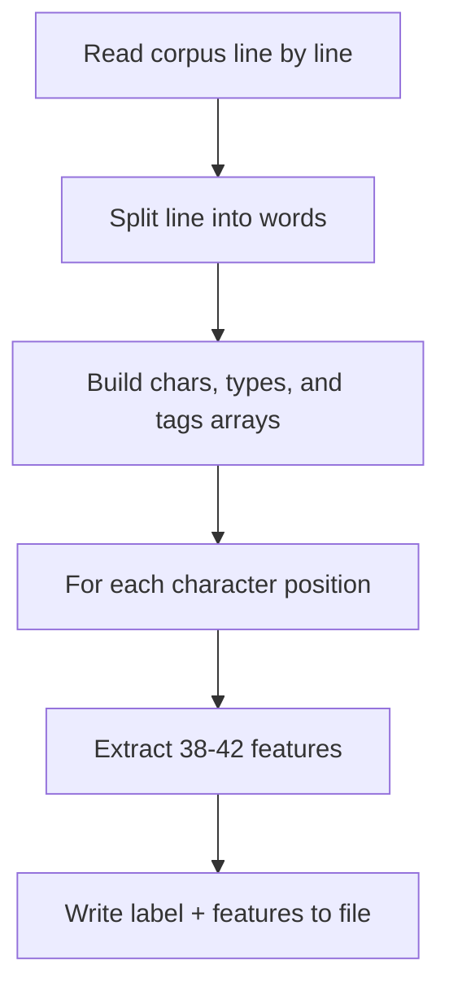

# Extracting Features

After preparing a corpus, the next step is to extract features for model training.

## Command

```sh
litsea extract -l <LANGUAGE> <CORPUS_FILE> <FEATURES_FILE>
```

## Example

```sh
litsea extract -l japanese ./corpus.txt ./features.txt
```

Output:

```text
Feature extraction completed successfully.
```

## What Happens Internally



1. The `Extractor` reads each line from the corpus
2. For each sentence, it creates a `Segmenter` context with character arrays, type arrays, and tag arrays
3. For each character position (except the first), it extracts features and writes them with the correct label

## Feature File Format

Each line represents one character position:

```text
1	UP1:U UP2:U UP3:U BP1:UU BP2:UU UW1:B2 UW2:B1 UW3:は ...
-1	UP1:U UP2:U UP3:B BP1:UB BP2:BU UW1:B1 UW2:は UW3:テ ...
```

- First column: label (`1` = boundary, `-1` = non-boundary)
- Remaining columns: features (tab-separated)

## File Size Expectations

The features file will be significantly larger than the corpus because each character position generates 38-42 feature strings. For a 1 MB corpus, expect a features file of roughly 50-100 MB.
