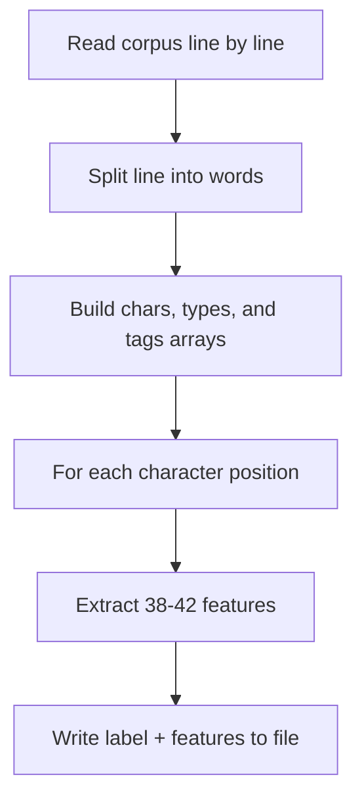

# Extracting Features

After preparing a corpus, the next step is to extract features for model training.

## Command

```sh
litsea extract -l <LANGUAGE> <CORPUS_FILE> <FEATURES_FILE>
```

## Example

```sh
litsea extract -l japanese ./corpus.txt ./features.txt
```

Output:

```text
Feature extraction completed successfully.
```

## What Happens Internally


```mermaid
flowchart TD
    A["Read corpus line by line"] --> B["Split line into words"]
    B --> C["Build chars, types, and tags arrays"]
    C --> D["For each character position"]
    D --> E["Extract 38-42 features"]
    E --> F["Write label + features to file"]
```

1. The `Extractor` reads each line from the corpus
2. For each sentence, it creates a `Segmenter` context with character arrays, type arrays, and tag arrays
3. For each character position (except the first), it extracts features and writes them with the correct label. The `--pos` pipeline also emits the first position, so that the first word's POS tag is part of the training data

## Feature File Format

Each line represents one character position. For the corpus line `これ は テスト です 。`, the first two lines are:

```text
-1	BC1:OI	BC2:II	BC3:II	BP1:UU	BP2:UU	BQ1:UOI	BQ2:UII	BQ3:UOI	BQ4:UII	...
1	BC1:II	BC2:II	BC3:IK	BP1:UU	BP2:UO	BQ1:UII	BQ2:UII	BQ3:OII	BQ4:OII	...
```

- First column: label (`1` = boundary, `-1` = non-boundary)
- Remaining columns: features, written tab-separated in alphabetically sorted order (so each line starts with the `BC1:` feature)

## POS Feature Extraction

For POS tagging models, use the `--pos` flag to extract features with POS labels instead of binary boundary labels.

### Command

```sh
litsea extract --pos -l <LANGUAGE> <CORPUS_FILE> <FEATURES_FILE>
```

### Example

```sh
litsea extract --pos -l japanese ./corpus.txt ./features.txt
```

### POS Labels

When extracting POS features, each character position is labeled with one of 18 segment labels instead of the binary `1`/`-1` labels:

- **B-NOUN**, **B-VERB**, **B-ADJ**, **B-ADP**, **B-ADV**, **B-AUX**, **B-CCONJ**, **B-DET**, **B-INTJ**, **B-NUM**, **B-PART**, **B-PRON**, **B-PROPN**, **B-PUNCT**, **B-SCONJ**, **B-SYM**, **B-X** -- Word boundary with the corresponding POS tag
- **O** -- Non-boundary (inside a word)

The feature template (character n-grams, type n-grams, etc.) is the same as for standard segmentation -- only the label scheme differs.

### POS Feature File Format

For the POS corpus line `これ/PRON は/PART テスト/NOUN です/AUX 。/PUNCT`, the first three lines are:

```text
B-PRON	BC1:OO	BC2:OI	BC3:II	BP1:UU	BP2:UU	BQ1:UOO	BQ2:UOI	BQ3:UOO	BQ4:UOI	...
O	BC1:OI	BC2:II	BC3:II	BP1:UU	BP2:UU	BQ1:UOI	BQ2:UII	BQ3:UOI	BQ4:UII	...
B-PART	BC1:II	BC2:II	BC3:IK	BP1:UU	BP2:UO	BQ1:UII	BQ2:UII	BQ3:OII	BQ4:OII	...
```

- First column: segment label (e.g., `B-PRON`, `O`)
- Remaining columns: features, written tab-separated in alphabetically sorted order (so each line starts with the `BC1:` feature)

## File Size Expectations

The features file will be significantly larger than the corpus because each character position generates 38-42 feature strings. For a 1 MB corpus, expect a features file of roughly 50-100 MB.
