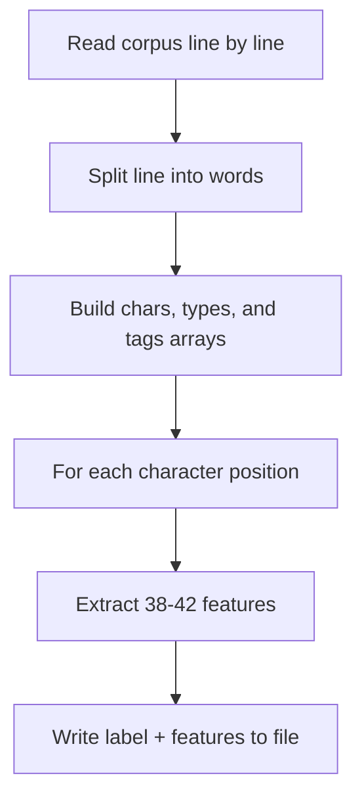

# Extracting Features

After preparing a corpus, the next step is to extract features for model training.

## Command

```sh
litsea extract -l <LANGUAGE> <CORPUS_FILE> <FEATURES_FILE>
```

## Example

```sh
litsea extract -l japanese ./corpus.txt ./features.txt
```

Output:

```text
Feature extraction completed successfully.
```

## What Happens Internally


```mermaid
flowchart TD
    A["Read corpus line by line"] --> B["Split line into words"]
    B --> C["Build chars, types, and tags arrays"]
    C --> D["For each character position"]
    D --> E["Extract 38-42 features"]
    E --> F["Write label + features to file"]
```

1. The `Extractor` reads each line from the corpus
2. For each sentence, it creates a `Segmenter` context with character arrays, type arrays, and tag arrays
3. For each character position (except the first), it extracts features and writes them with the correct label. The two-stage stage-1 pipeline also emits the first position, so that the first word's boundary decision is part of the training data

## Feature File Format

Each line represents one character position. For the corpus line `これ は テスト です 。`, the first two lines are:

```text
-1	BC1:OI	BC2:II	BC3:II	BP1:UU	BP2:UU	BQ1:UOI	BQ2:UII	BQ3:UOI	BQ4:UII	...
1	BC1:II	BC2:II	BC3:IK	BP1:UU	BP2:UO	BQ1:UII	BQ2:UII	BQ3:OII	BQ4:OII	...
```

- First column: label (`1` = boundary, `-1` = non-boundary)
- Remaining columns: features, written tab-separated in alphabetically sorted order (so each line starts with the `BC1:` feature)

## Space-Preserving (TSV) Corpus Format

For a corpus that preserves the original spacing of the sentence -- used to
train the Korean and English models, since inter-word spaces are their
strongest boundary signal (see
[Korean](../language-support/korean.md#space-preserving-training) and
[English](../language-support/english.md#space-preserving-training))
-- pass `--format tsv` instead of extracting from the default
space-separated format:

```sh
litsea extract --format tsv -l korean ./ko_corpus.tsv ./ko_features.txt
litsea extract --format tsv --tag-free -l english ./en_corpus.tsv ./en_features.txt
```

The input is a tab-separated corpus (one sentence per line, tokens
separated by tabs) in which a token may be a literal space character
(`" "`). The output feature file format is identical to the default
`extract`; only the corpus parsing differs. `--format tsv` also combines
with `--pos` -- see [Two-Stage Feature
Extraction](#two-stage-feature-extraction) below.

## Two-Stage Feature Extraction

For [two-stage POS tagging](../algorithm/two-stage-tagging.md) (issue #147),
use `--pos`:

```sh
litsea extract --pos [--stage2-features full|balanced|fast] <CORPUS_FILE> <FEATURES_PREFIX>
```

### Example

```sh
litsea extract --pos -l japanese ./pos_corpus.txt ./pos_features
```

`--pos` reads a POS-tagged corpus
(`word/POS word/POS ...`) and, in a single pass over the corpus, writes
**three** files from `<FEATURES_PREFIX>` instead of one:

| File | Contents |
|------|----------|
| `<FEATURES_PREFIX>.stage1` | Boundary features (label `B` or `O`), the same character-level templates as plain extraction, emitted at every position including the first |
| `<FEATURES_PREFIX>.stage2` | Word-level features (label a UPOS tag), the templates selected by `--stage2-features` |
| `<FEATURES_PREFIX>.lexicon` | The candidate-tag lexicon (`surface\tTAG:count[,TAG:count...]`, most-frequent-first) |

`litsea train --pos` reads all three files back from the same
prefix. Combine with `--format tsv` (issue #198) when the corpus is the space-preserving `word/POS` TSV that `corpus_udtreebank.sh -p -s` emits — the protocol the bundled Korean and English two-stage models are trained on.

### Choosing `--stage2-features`

`--stage2-features` selects which stage-2 word-level templates (see
[Word-Level Feature Templates](../algorithm/feature-extraction.md#word-level-feature-templates-two-stage))
get written to `<FEATURES_PREFIX>.stage2`, trading tagging quality for
throughput:

| Value | Templates | Trade-off |
|-------|-----------|-----------|
| `full` | All 23 word templates | Most accurate, slowest |
| `balanced` | A subset of `full` | Middle ground |
| `fast` (default) | The smallest subset | Fastest, still competitive quality |

See [Choosing a stage-2 feature
set](../algorithm/two-stage-tagging.md#choosing-a-stage-2-feature-set) for
the measured quality/throughput comparison behind this default.

```sh
litsea extract --pos --stage2-features balanced -l chinese ./pos_corpus.txt ./pos_features
```

## File Size Expectations

The features file will be significantly larger than the corpus because each character position generates 38-42 feature strings. For a 1 MB corpus, expect a features file of roughly 50-100 MB.
