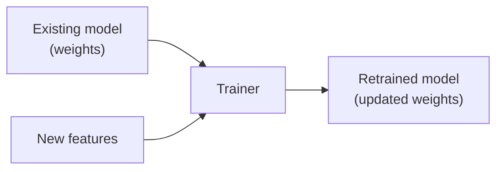

# Retraining Models

You can improve an existing model by resuming training with new data.

## Command

```sh
litsea train -t 0.005 -i 1000 -m <EXISTING_MODEL> <NEW_FEATURES_FILE> <OUTPUT_MODEL>
```

## Example

```sh
# Extract features from new corpus
litsea extract -l japanese ./new_corpus.txt ./new_features.txt

# Retrain from existing model
litsea train -t 0.005 -i 1000 \
    -m ./resources/japanese.model \
    ./new_features.txt \
    ./resources/japanese_v2.model
```

## How It Works



1. The trainer initializes features and instances from the new features file
2. It loads the existing model weights via `-m`
3. Training continues with the loaded weights as a starting point
4. The new model inherits all learned patterns and refines them with new data

## Use Cases

- **Domain adaptation** -- Fine-tune a general model on domain-specific text (e.g., medical, legal)
- **Incremental improvement** -- Add more training data without retraining from scratch
- **Error correction** -- Train on examples where the current model makes mistakes

## Notes

- The output model can be the same path as the input model (overwrites)
- The `-m` flag accepts file paths, `file://`, `http://`, and `https://` URIs
- Retraining starts from the existing weights, so fewer iterations may be needed
