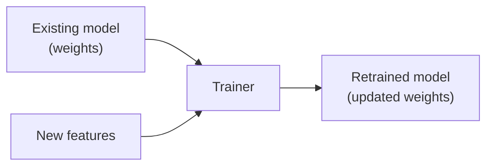

# Retraining Models

You can improve an existing model by resuming training with new data.

## Command

```sh
litsea train -t 0.0001 -i 20000 -m <EXISTING_MODEL> <NEW_FEATURES_FILE> <OUTPUT_MODEL>
```

## Example

```sh
# Extract features from new corpus
litsea extract -l japanese ./new_corpus.txt ./new_features.txt

# Retrain from existing model
litsea train -t 0.0001 -i 20000 \
    -m ./models/my_model.model \
    ./new_features.txt \
    ./models/my_model_v2.model
```

## How It Works


```mermaid
flowchart LR
    A["Existing model<br/>(weights)"] --> C["Trainer"]
    B["New features"] --> C
    C --> D["Retrained model<br/>(updated weights)"]
```

1. The trainer initializes features and instances from the new features file
2. It loads the existing model weights via `-m`
3. Training continues with the loaded weights as a starting point
4. The new model inherits all learned patterns and refines them with new data

## Use Cases

- **Domain adaptation** -- Fine-tune a general model on domain-specific text (e.g., medical, legal)
- **Incremental improvement** -- Add more training data without retraining from scratch
- **Error correction** -- Train on examples where the current model makes mistakes

## Notes

- The output model can be the same path as the input model (overwrites)
- The `-m` flag accepts file paths, `file://`, `http://`, and `https://` URIs
- Retraining starts from the existing weights, so fewer iterations may be needed
- `-m` is only available for plain AdaBoost training. `train --two-stage`
  does **not** support `-m`/`--load-model-uri` -- incremental training of a
  two-stage model is not supported, so if you need to update one you must
  retrain it from scratch with `train --two-stage`
- The bundled `japanese.model`, `chinese.model`, and `korean.model` are not
  produced with this plain `-m` recipe -- they go through the
  perceptron-collapse procedure described in [Training
  Procedure](../pre-trained-models.md#training-procedure). Running further
  incremental AdaBoost training on top of one of them with `-m` would mix
  the two approaches; to update one of the bundled models, retrain it from
  scratch with that procedure instead
