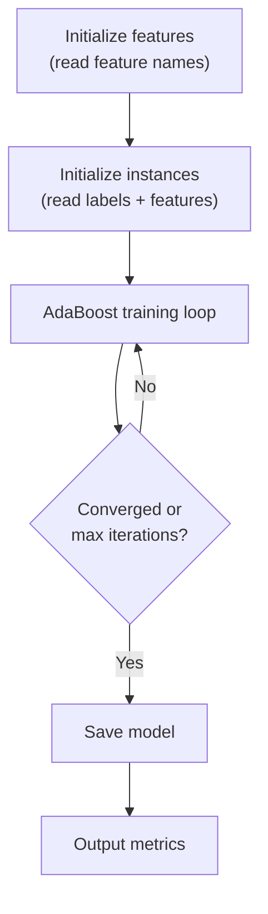

# Training Models

Once features are extracted, train a model using AdaBoost.

## Command

```sh
litsea train [OPTIONS] <FEATURES_FILE> <MODEL_FILE>
```

## Basic Example

```sh
litsea train -t 0.005 -i 1000 ./features.txt ./resources/japanese.model
```

## Training Process



1. **Initialize features** -- Reads the features file to build the feature index
2. **Initialize instances** -- Reads again to load labeled instances and initial weights
3. **Training loop** -- Iteratively selects the best feature, updates model weights, and reweights instances
4. **Save model** -- Writes non-zero feature weights to the model file
5. **Output metrics** -- Prints accuracy, precision, recall, and confusion matrix

## Hyperparameters

| Parameter | Flag | Default | Guidance |
|-----------|------|---------|----------|
| Threshold | `-t` | 0.01 | Start with 0.005. Lower values allow more iterations but increase training time |
| Iterations | `-i` | 100 | Start with 1000. Increase if accuracy is still improving when training stops |

## Interpreting Output

```text
Result Metrics:
  Accuracy: 94.15% ( 564133 / 599198 )
  Precision: 95.57% ( 330454 / 345758 )
  Recall: 94.36% ( 330454 / 350215 )
  Confusion Matrix:
    True Positives: 330454
    False Positives: 15304
    False Negatives: 19761
    True Negatives: 233679
```

- **Accuracy** -- Percentage of correct predictions (both boundaries and non-boundaries)
- **Precision** -- Of predicted boundaries, what fraction is correct
- **Recall** -- Of actual boundaries, what fraction was found
- **True Positives** -- Correctly predicted boundaries
- **False Positives** -- Predicted boundary where there is none
- **False Negatives** -- Missed actual boundaries
- **True Negatives** -- Correctly predicted non-boundaries

## Graceful Interruption

Press **Ctrl+C once** during training to stop and save the model at its current state. Press **Ctrl+C twice** to exit immediately without saving.
