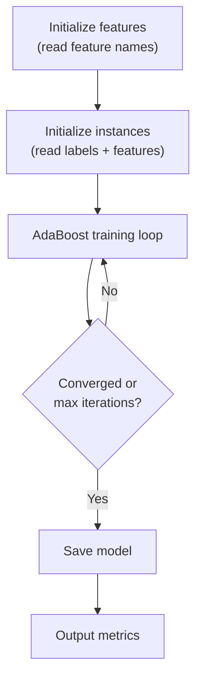

# Training Models

Once features are extracted, train a model using AdaBoost.

## Command

```sh
litsea train [OPTIONS] <FEATURES_FILE> <MODEL_FILE>
```

## Basic Example

```sh
litsea train -t 0.0001 -i 20000 ./features.txt ./models/my_model.model
```

This is a generic example of plain AdaBoost training. The bundled
`japanese.model`, `chinese.model`, and `korean.model` are **not** produced
this way -- see [Training Procedure](../pre-trained-models.md#training-procedure)
for the procedure actually used for those files.

## Training Process


```mermaid
flowchart TD
    A["Initialize features<br/>(read feature names)"] --> B["Initialize instances<br/>(read labels + features)"]
    B --> C["AdaBoost training loop"]
    C --> D{"Converged or<br/>max iterations?"}
    D -->|No| C
    D -->|Yes| E["Save model"]
    E --> F["Output metrics"]
```

1. **Initialize features** -- Reads the features file to build the feature index
2. **Initialize instances** -- Reads again to load labeled instances and initial weights
3. **Training loop** -- Iteratively selects the best feature, updates model weights, and reweights instances
4. **Save model** -- Writes non-zero feature weights to the model file
5. **Output metrics** -- Prints accuracy, precision, recall, and confusion matrix

## Hyperparameters

| Parameter | Flag | Default | Guidance |
|-----------|------|---------|----------|
| Threshold | `-t` | 0.01 | Start with 0.0001. Lower values delay early stopping but increase training time |
| Iterations | `-i` | 100 | Start with 20000. AdaBoost selects one feature per iteration, so this caps the number of features in the model; the default produces very small models with much lower held-out accuracy |

**Note**: these are generic starting points for training a plain AdaBoost
model from scratch. The bundled `japanese.model`, `chinese.model`, and
`korean.model` are produced by a different procedure -- a 2-class Averaged
Perceptron collapsed to AdaBoost weights, with per-language epoch counts
and pruning -- see [Training Procedure](../pre-trained-models.md#training-procedure)
in Pre-trained Models for how those files are actually made.

## Interpreting Output

Metrics are computed on the training data; with enough iterations the model can fit the training corpus almost perfectly, so evaluate on held-out text for a realistic quality estimate. The numbers below are a representative example of `train`'s output format, not the bundled `japanese.model`'s actual training log.

```text
Result Metrics:
  Accuracy: 100.00% ( 1075868 / 1075869 )
  Precision: 100.00% ( 161283 / 161284 )
  Recall: 100.00% ( 161283 / 161283 )
  Confusion Matrix:
    True Positives: 161283
    False Positives: 1
    False Negatives: 0
    True Negatives: 914585
```

- **Accuracy** -- Percentage of correct predictions (both boundaries and non-boundaries)
- **Precision** -- Of predicted boundaries, what fraction is correct
- **Recall** -- Of actual boundaries, what fraction was found
- **True Positives** -- Correctly predicted boundaries
- **False Positives** -- Predicted boundary where there is none
- **False Negatives** -- Missed actual boundaries
- **True Negatives** -- Correctly predicted non-boundaries

## Graceful Interruption

Press **Ctrl+C once** during training to stop and save the model at its current state. Press **Ctrl+C twice** to exit immediately without saving.

## Generic Perceptron Training

For the bundled segmentation models' collapse recipe (see [Training
Procedure](../pre-trained-models.md#training-procedure)), use the
`--perceptron` flag. It trains a multiclass **Averaged Perceptron** over
opaque string labels from a `label\tfeature\t...` features file.

### Perceptron Training Command

```sh
litsea train --perceptron --num-epochs 50 <FEATURES_FILE> <MODEL_FILE>
```

### Perceptron Training Output

```text
Result Metrics (Perceptron):
  Accuracy: 98.23% ( 277213 )
  Macro Precision: 96.82%
  Macro Recall: 93.30%
```

- **Accuracy** -- Percentage of correct predictions across all classes
- **Macro Precision** -- Average precision across all classes
- **Macro Recall** -- Average recall across all classes

Press **Ctrl+C once** during perceptron training to stop and save the model at its current state. Press **Ctrl+C twice** to exit immediately without saving.

## Two-Stage Model Training

For POS tagging, use the `--pos` flag. It
trains a [two-stage model](../algorithm/two-stage-tagging.md) (issue #147):
a binary boundary classifier (stage 1) plus a word-level tagger (stage 2),
assembled with a candidate-tag lexicon into a single `litsea-two-stage v1`
file. See [Two-Stage Tagging](../algorithm/two-stage-tagging.md)
for the architecture and the measured quality/speed figures.

### Two-Stage Training Command

```sh
litsea extract --pos <CORPUS_FILE> <FEATURES_PREFIX>
litsea train --pos --num-epochs 50 <FEATURES_PREFIX> <MODEL_FILE>
```

`extract --pos` reads a `word/POS` corpus and
writes three files from `FEATURES_PREFIX`; `train --pos` reads them
back from the same prefix.

### Two-Stage Training Example

```sh
litsea extract --pos -l japanese ./pos_corpus.txt ./pos_features
litsea train --pos --num-epochs 50 ./pos_features ./models/japanese_pos.model
```

### Two-Stage Hyperparameters

| Parameter | Flag | Default | Guidance |
|-----------|------|---------|----------|
| Epochs | `--num-epochs` | 10 | An epoch sweep during bundling (see [the methodology note](../algorithm/two-stage-tagging.md#a-methodology-note-use-enough-training-epochs)) found segmentation quality still improving well past the default and plateauing around **50** -- the bundled models use 50, not 10 |
| Dominance | `--dominance` | 0.99 | Classifier-skip threshold in `(0.5, 1.0]`: a known word whose most frequent tag covers at least this fraction of its training occurrences is tagged without invoking the stage-2 classifier. Lower values skip the classifier more often (faster, more reliant on the lexicon); the default matches the bundled models |
| Stage-2 feature set | `--stage2-features` on `extract --pos` | `fast` | `full`, `balanced`, or `fast`; see [Extracting Features](extracting-features.md) and [choosing a feature set](../algorithm/two-stage-tagging.md#choosing-a-stage-2-feature-set) |

### Two-Stage Training Output

```text
Result Metrics (Two-Stage):
  Stage 1 (boundary) Accuracy: 99.86% ( 277213 )
  Stage 1 Macro Precision: 99.85%
  Stage 1 Macro Recall: 99.86%
  Stage 2 (tagging) Accuracy: 99.09% ( 168333 )
  Stage 2 Macro Precision: 98.96%
  Stage 2 Macro Recall: 98.77%
```

As with the other modes, these are in-sample metrics;
evaluate on held-out text with `litsea evaluate --pos` for a realistic
quality estimate.

### Two-Stage Graceful Interruption

Press **Ctrl+C once** during two-stage training to stop and save the model at its current state. Press **Ctrl+C twice** to exit immediately without saving.
