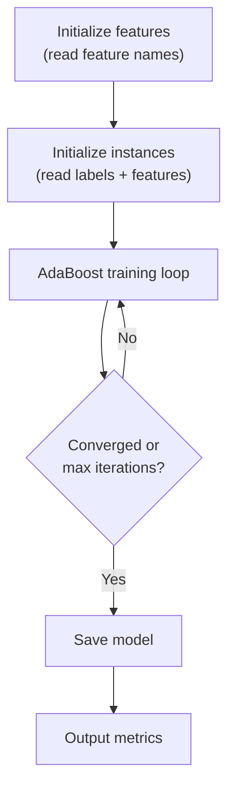

# Training Models

Once features are extracted, train a model using AdaBoost.

## Command

```sh
litsea train [OPTIONS] <FEATURES_FILE> <MODEL_FILE>
```

## Basic Example

```sh
litsea train -t 0.0001 -i 20000 ./features.txt ./models/japanese.model
```

## Training Process


```mermaid
flowchart TD
    A["Initialize features<br/>(read feature names)"] --> B["Initialize instances<br/>(read labels + features)"]
    B --> C["AdaBoost training loop"]
    C --> D{"Converged or<br/>max iterations?"}
    D -->|No| C
    D -->|Yes| E["Save model"]
    E --> F["Output metrics"]
```

1. **Initialize features** -- Reads the features file to build the feature index
2. **Initialize instances** -- Reads again to load labeled instances and initial weights
3. **Training loop** -- Iteratively selects the best feature, updates model weights, and reweights instances
4. **Save model** -- Writes non-zero feature weights to the model file
5. **Output metrics** -- Prints accuracy, precision, recall, and confusion matrix

## Hyperparameters

| Parameter | Flag | Default | Guidance |
|-----------|------|---------|----------|
| Threshold | `-t` | 0.01 | Start with 0.0001 (used for the bundled models). Lower values delay early stopping but increase training time |
| Iterations | `-i` | 100 | Start with 20000 (used for the bundled models). AdaBoost selects one feature per iteration, so this caps the number of features in the model; the default produces very small models with much lower held-out accuracy |

## Interpreting Output

Metrics are computed on the training data; with enough iterations the model can fit the training corpus almost perfectly, so evaluate on held-out text for a realistic quality estimate.

```text
Result Metrics:
  Accuracy: 100.00% ( 1075868 / 1075869 )
  Precision: 100.00% ( 161283 / 161284 )
  Recall: 100.00% ( 161283 / 161283 )
  Confusion Matrix:
    True Positives: 161283
    False Positives: 1
    False Negatives: 0
    True Negatives: 914585
```

- **Accuracy** -- Percentage of correct predictions (both boundaries and non-boundaries)
- **Precision** -- Of predicted boundaries, what fraction is correct
- **Recall** -- Of actual boundaries, what fraction was found
- **True Positives** -- Correctly predicted boundaries
- **False Positives** -- Predicted boundary where there is none
- **False Negatives** -- Missed actual boundaries
- **True Negatives** -- Correctly predicted non-boundaries

## Graceful Interruption

Press **Ctrl+C once** during training to stop and save the model at its current state. Press **Ctrl+C twice** to exit immediately without saving.

## POS Model Training

For training POS tagging models, use the `--pos` flag. POS models use the **Averaged Perceptron** algorithm (multiclass classifier) instead of AdaBoost (binary classifier).

### POS Training Command

```sh
litsea train --pos --num-epochs 10 <FEATURES_FILE> <MODEL_FILE>
```

### POS Training Example

```sh
litsea train --pos --num-epochs 10 ./features.txt ./models/japanese_pos.model
```

### Averaged Perceptron vs AdaBoost

| Aspect | AdaBoost (Segmentation) | Averaged Perceptron (POS) |
|--------|------------------------|---------------------------|
| Classification | Binary (boundary / non-boundary) | Multiclass (18 segment labels) |
| Labels | `1`, `-1` | `B-NOUN`, `B-VERB`, ..., `O` |
| Hyperparameters | Threshold, Iterations | Number of epochs |
| Model size | ~18-22 KB | ~9-19 MB |

### POS Hyperparameters

| Parameter | Flag | Default | Guidance |
|-----------|------|---------|----------|
| Epochs | `--num-epochs` | 10 | Number of passes over the training data. Start with 10 and adjust based on metrics |

### POS Training Output

```text
Result Metrics (POS):
  Accuracy: 98.23% ( 277213 )
  Macro Precision: 96.82%
  Macro Recall: 93.30%
```

- **Accuracy** -- Percentage of correct predictions across all classes
- **Macro Precision** -- Average precision across all POS classes
- **Macro Recall** -- Average recall across all POS classes

### POS Graceful Interruption

Press **Ctrl+C once** during POS training to stop and save the model at its current state. Press **Ctrl+C twice** to exit immediately without saving.
